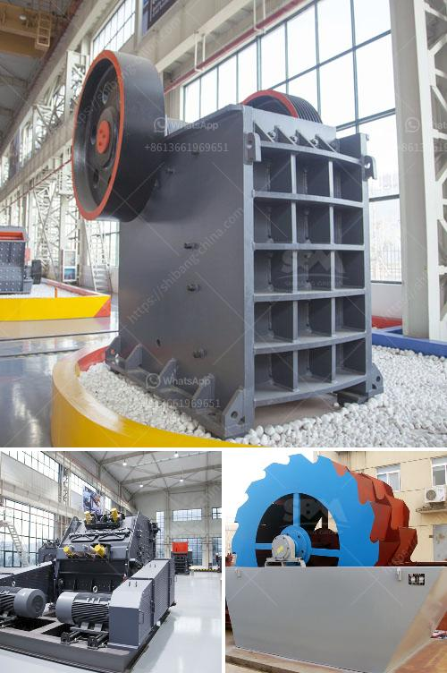

<h3>chromite beneficiation plant in malaysia</h3>
Chromite beneficiation plant, also known as chromite processing plant or chromite ore beneficiation plant, is a crucial part of the metallurgical industry in Malaysia. Nowadays, beneficiation plant is widely used in many industries, such as cement, silicate products, new building materials, refractories, fertilizers, black and non-ferrous metal processing and glass ceramics.

Chromite is a mineral composed primarily of iron, magnesium, and chromium oxide: (Fe, Mg) Cr2O4. It is a kind of spinel, a compound mineral existing in rocks, and is the main ore of chromium.

The chromite mining process in Malaysia mainly includes extraction, crushing, grinding, beneficiation, and processing. Extraction refers to extracting chromite ore from the deposit. Crushing includes primary crushing and secondary crushing. Grinding refers to processing chromite ore into powders or small particles. Beneficiation includes physical processes like gravity separation, magnetic separation, and flotation, as well as chemical processes like leaching and acid digestion. Finally, processed chromite ore can be used in various industries.

The chromite beneficiation plant in Malaysia features high automation, low operation cost, high crushing ratio, low energy consumption, reliable operation, easy maintenance, and so on. The beneficiation plant also can use mechanical and chemical methods. Generally, the equipment for beneficiation includes crusher, vibrating screen, jig machine, magnetic separator, flotation machine, classifier, ball mill, slurry pump, shaking table, and centrifugal separator, etc. Some specific beneficiation equipment can be customized according to clients' requirements.

In Malaysia, the selected chromite beneficiation plants have been in operation for a considerable time without any major technical issues. The plants have been designed to treat chromite exclusively, and they have been successfully processing chromite ores to benefit from the valuable minerals.

The chromite beneficiation plant in Malaysia primarily concentrates chromite through gravity separation methods. By using spiral classifiers or hydrocyclones, the chromite ore can be graded into different sizes, and then goes for further beneficiation using magnetic separation or flotation separation techniques. These methods allow for efficient recovery of chromite particles with different sizes and can achieve the desired chromite concentration.

In conclusion, the chromite beneficiation plant in Malaysia plays an important role in the mining and metallurgical industry, contributing to the economic growth of the country. With the continuous development and advancement of technology, more efficient and cost-effective beneficiation techniques are being developed, offering immense potential for increased chromite recovery. As the demand for chromium increases worldwide, the chromite beneficiation industry will continue to thrive, driving the development of more advanced and sustainable beneficiation plants in Malaysia and beyond.
<h3>Contact us</h3><ul><li><strong>Whatsapp:&nbsp;<a href="https://wa.me/8613661969651">+8613661969651</a></strong></li><li><a href="https://swt.shibang-china.com/?git&amp;zhl&amp;chromite beneficiation plant in malaysia"><strong>Online Service(chat now)</strong></a></li></ul><h3>Related</h3><ul><li><a href='roller mill manufacturers.md'>roller mill manufacturers</a></li><li><a href='400 mesh grinding mill equipment.md'>400 mesh grinding mill equipment</a></li><li><a href='power of a roller mill.md'>power of a roller mill</a></li><li><a href='crawler type mobile crusher.md'>crawler type mobile crusher</a></li><li><a href='cost of mobile crusher in india.md'>cost of mobile crusher in india</a></li></ul>