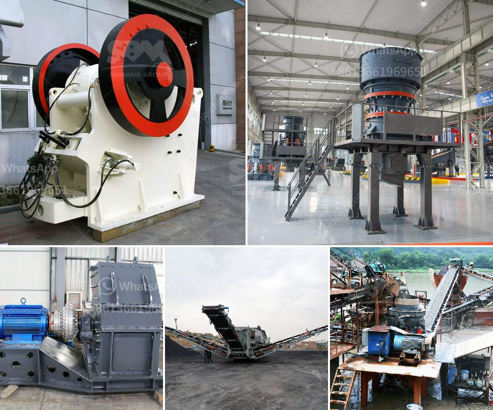

<h3>chromite beneficiation plants malaysia</h3>
Chromite is a mineral that is primarily used for the production of ferrochrome, which is a key ingredient in the manufacturing of stainless steel. Malaysia holds significant reserves of chromite, making it an important player in the global chromite market.

To fully exploit Malaysia's chromite deposits, the establishment of beneficiation plants is necessary. These plants would process the chromite ore into usable products for industries, such as stainless steel manufacturing. In Malaysia, several chromite beneficiation plants have been set up over the years to cater to the growing demand for ferrochrome.

Chromite beneficiation involves a series of processes, such as crushing, screening, grinding, and classification. The chromite ore is first crushed and ground to a fine powder. It is then subjected to various physical and chemical processes to separate the chromite from the waste materials.

One of the commonly used beneficiation methods is gravity concentration, which utilizes the differences in density between the chromite and the waste materials. In this process, the crushed chromite ore is mixed with water and introduced to a shaking table or a jig machine. The heavier chromite particles settle at the bottom, while the lighter waste materials are washed away.

Another beneficiation method is magnetic separation, which exploits the magnetic properties of chromite. The crushed ore is passed through magnetic separators to separate the chromite from the non-magnetic waste materials. This method is particularly useful for removing magnetic impurities from the high-quality chromite concentrate.

In addition to gravity concentration and magnetic separation, Malaysia's chromite beneficiation plants may also employ other techniques, such as flotation and leaching. Flotation involves the use of chemicals to selectively separate the chromite from the waste materials. Leaching, on the other hand, utilizes chemicals to dissolve the chromite and recover it as a soluble compound.

The beneficiation plants in Malaysia are typically equipped with advanced technology and machinery to ensure efficient and effective chromite processing. These plants play a crucial role in enhancing the value and usability of Malaysia's chromite reserves.

The chromite beneficiation plants in Malaysia are not only beneficial for the local industry's growth but also contribute to the global stainless steel market. Malaysia's chromite production enables stainless steel manufacturers worldwide to obtain high-quality ferrochrome, which is essential for the production of corrosion-resistant stainless steel.

Furthermore, the establishment of chromite beneficiation plants in Malaysia is beneficial for the country's economy. The mining and processing of chromite provide employment opportunities and generate revenue for the government. These plants also promote industrial development and contribute to Malaysia's position as a key player in the global chromite market.

In conclusion, the establishment of chromite beneficiation plants in Malaysia is crucial for the efficient utilization of the country's chromite reserves. These plants employ various beneficiation methods, such as gravity concentration, magnetic separation, flotation, and leaching, to process the chromite ore into usable products. The chromite beneficiation plants in Malaysia not only contribute to the global stainless steel market but also provide economic benefits for the country.
<h3>Contact us</h3><ul><li><strong>Whatsapp:&nbsp;<a href="https://wa.me/8613661969651">+8613661969651</a></strong></li><li><a href="https://swt.shibang-china.com/?git&amp;zhl&amp;chromite beneficiation plants malaysia"><strong>Online Service(chat now)</strong></a></li></ul><h3>Related</h3><ul><li><a href='how to draw a stone crusher.md'>how to draw a stone crusher</a></li><li><a href='vertical grinding process.md'>vertical grinding process</a></li><li><a href='vibrating screen in cement plant.md'>vibrating screen in cement plant</a></li><li><a href='kenya cement plant.md'>kenya cement plant</a></li><li><a href='gypsum ball mill manufacturing machine.md'>gypsum ball mill manufacturing machine</a></li></ul>