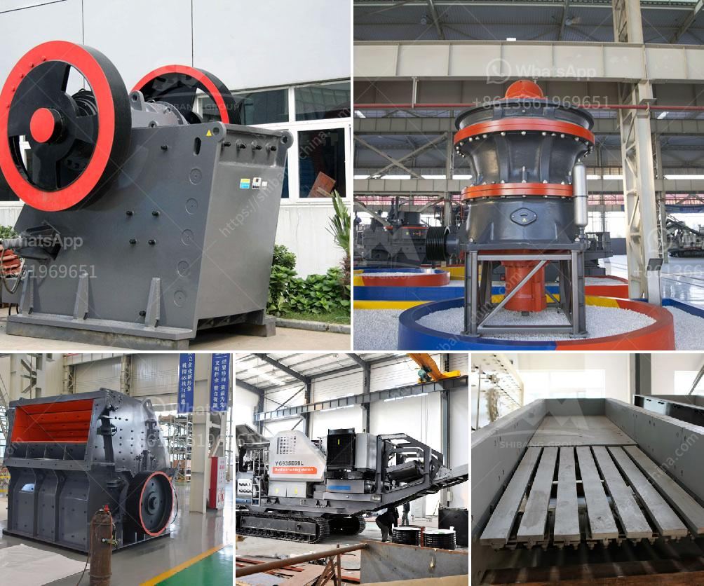

<h3>chromite processing plant equipment for pakistan</h3>
Chromite is a mineral composed primarily of iron, magnesium, and chromium oxide: (Fe, Mg) Cr2O4. It is a kind of spinel-type mineral, which is considered the most important ore of chromium. Pakistan is rich in chromite resources, with an estimated 2 billion tons of deposits spread across the country.

The extraction of chromite ore in Pakistan is carried out in a variety of methods, such as underground mining, opencast mining, and beneficiation facilities. Chromite processing plants in Pakistan use various mineral processing techniques to separate chromite ore from gangue minerals and produce high-grade chromite concentrate.

Chromite processing plant equipment for Pakistan mainly includes crushing equipment (jaw crusher), hammer crusher, cone crusher, grinding equipment (ball mill, raymond mill, vertical mill), classifier, flotation separation machine, magnetic separation machine, shaking table, spiral chute, and concentration plant.

Crushing is the first stage in the comminution process, which aims to reduce the large size of chromite ores into smaller particles suitable for further processing. Jaw crusher and cone crusher are commonly used for crushing chromite ore. Hammer crusher can be used in secondary crushing stage.

Grinding is an essential step in chromite processing, which involves reducing the size of chromite particles to a finer size for beneficiation. Ball mill, raymond mill, and vertical mill are commonly used grinding equipment in chromite processing plants. Ball mill is suitable for grinding chromite ore in large quantities. Raymond mill and vertical mill are more suitable for small-scale operations.

After grinding, the chromite ore is usually concentrated using gravity separation, magnetic separation, or flotation techniques. The concentrate is then further refined through smelting to produce ferrochromium alloys, which are widely used in the metallurgical, chemical, and refractory industries. In chromite processing plants, gravity separation equipment such as shaking table and spiral chute are commonly used for gravity separation. Magnetic separation equipment includes magnetic separator and high-intensity magnetic separator. Flotation separation equipment includes flotation machine and flotation column.

The chromite processing plant equipment in Pakistan is designed to increase productivity and improve product quality. The robust and efficient design of chromite processing equipment produces a consistent product size distribution to maximize beneficiation efficiency, while minimizing the generation of fines.

The chromite processing plant equipment in Pakistan is backed by highly trained technical service teams that provide support throughout the entire lifecycle of the equipment, ensuring optimal performance and minimal downtime. Additionally, operators are trained in the operation and maintenance of the equipment to ensure safe and efficient processing.

In conclusion, Pakistan's chromite processing plants use a range of equipment to extract and refine chromite ore, producing high-grade chromite concentrate. The crushing, grinding, concentration, and beneficiation processes are carried out using state-of-the-art equipment to maximize productivity and efficiency. With the abundance of chromite resources in Pakistan, investments in chromite processing plants are crucial for the country's economic growth and development.
<h3>Contact us</h3><ul><li><strong>Whatsapp:&nbsp;<a href="https://wa.me/8613661969651">+8613661969651</a></strong></li><li><a href="https://swt.shibang-china.com/?git&amp;zhl&amp;chromite processing plant equipment for pakistan"><strong>Online Service(chat now)</strong></a></li></ul><h3>Related</h3><ul><li><a href='bentonite clay processing plant.md'>bentonite clay processing plant</a></li><li><a href='floatation method of analysis for silica sand.md'>floatation method of analysis for silica sand</a></li><li><a href='calcium carbonate plant price.md'>calcium carbonate plant price</a></li><li><a href='dry process of cement manufacturing.md'>dry process of cement manufacturing</a></li><li><a href='project report clinker grinding.md'>project report clinker grinding</a></li></ul>