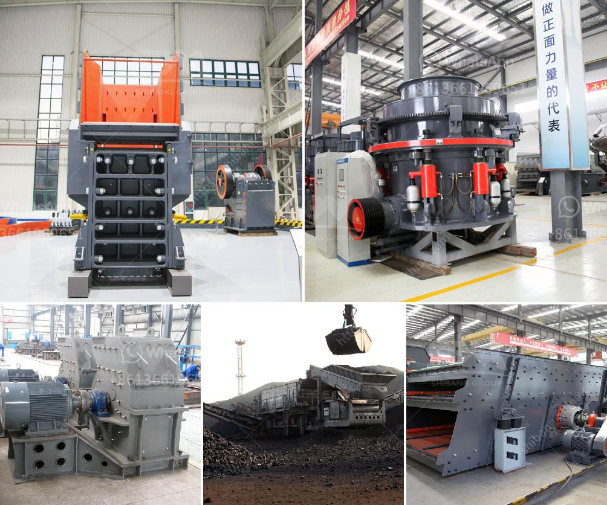

<h3>classifier of cement ball mill</h3>
The cement ball mill is a vital tool for grinding various materials into powder to form a slurry mixture. Due to its widespread application, the classifier of the cement ball mill is essential for ensuring the efficiency and quality of the grinding process.

In recent years, the requirements for cement quality have been increasing. Therefore, more attention must be paid to improving the performance of the classifier in the cement ball mill. The classifier is responsible for grading the powder and returning the coarse particles to the grinding chamber for further grinding.

There are several types of classifiers commonly used in cement ball mills, including static classifiers, dynamic classifiers, and high-efficiency classifiers. The choice of classifier depends on various factors such as the desired particle size distribution and the grinding capacity of the cement ball mill.

Static classifiers are the simplest and most common type. They rely on gravity and airflow to separate the particles. Static classifiers are suitable for fine and medium-fine grinding applications but have limited efficiency in separating fine particles.

Dynamic classifiers use airflow and centrifugal force to separate the particles. They have higher efficiency than static classifiers and are capable of handling a wider range of particle sizes. However, dynamic classifiers are more complex and require more maintenance.

High-efficiency classifiers, also known as third-generation classifiers, are the most advanced type. They combine the advantages of static and dynamic classifiers and are capable of achieving higher separation efficiency. High-efficiency classifiers are recommended for cement ball mills with high circulating loads and/or high grinding capacities.

In conclusion, the classifier of the cement ball mill plays a crucial role in ensuring the efficiency and quality of the grinding process. The choice of classifier depends on the desired particle size distribution and grinding capacity of the cement ball mill. Static, dynamic, and high-efficiency classifiers are commonly used in cement ball mills, with each having its advantages and limitations. By selecting the appropriate classifier, cement manufacturers can optimize the grinding process and improve the overall quality of the final product.
<h3>Contact us</h3><ul><li><strong>Whatsapp:&nbsp;<a href="https://wa.me/8613661969651">+8613661969651</a></strong></li><li><a href="https://swt.shibang-china.com/?git&amp;zhl&amp;classifier of cement ball mill"><strong>Online Service(chat now)</strong></a></li></ul><h3>Related</h3><ul><li><a href='mill balls for mining.md'>mill balls for mining</a></li><li><a href='200 tph crusher plant.md'>200 tph crusher plant</a></li><li><a href='rock crushing machine for sale.md'>rock crushing machine for sale</a></li><li><a href='pharma grade kaolin process.md'>pharma grade kaolin process</a></li><li><a href='limestone used for making glass.md'>limestone used for making glass</a></li></ul>