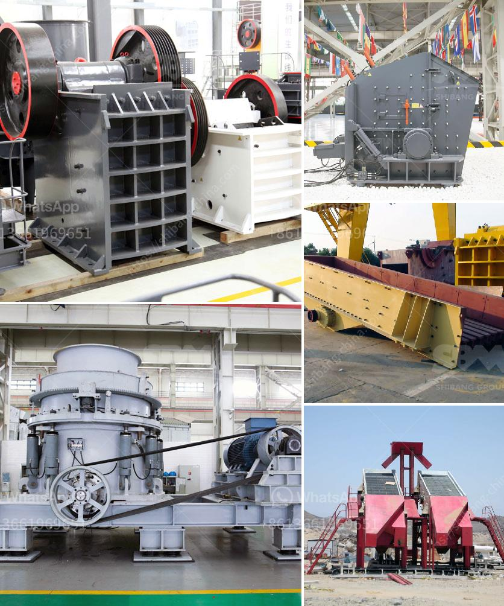

<h3>clay ball mills south africa</h3>
South Africa is one of the most progressive countries in terms of embracing sustainable practices and shifting towards a green economy. From renewable energy projects to waste management initiatives, the nation is making significant strides to improve environmental performance. One area that is gaining attention is the clay ball milling industry, which plays a crucial role in various sectors including mining, ceramics, and construction.

Clay ball mills, also known as clay grinding mills, are critical machines used for the crushing and grinding of clay ores by mechanical forces. The industry is predominantly operated by large-scale manufacturers who extract raw materials from mines, process them into fine particles, and then market them to various industries.

Traditionally, the clay ball milling industry in South Africa has been associated with environmental concerns. The extraction of clay ores often involves land disruption, water pollution, and high energy consumption. Additionally, the grinding process releases fine particles into the air, which can have detrimental effects on human health and ecosystems.

However, in recent years, there has been a paradigm shift towards sustainability within the clay ball milling industry in South Africa. Manufacturers are increasingly adopting eco-friendly practices, aiming to reduce their environmental footprint and improve operational efficiency. Here are some key initiatives contributing to this positive transformation:

Water is a precious resource in South Africa, and clay ball milling operations can be water-intensive. Manufacturers are implementing water recycling and reuse systems to minimize their water consumption. By treating and reusing process water, companies are reducing their reliance on freshwater sources and reducing pollution.

To combat high energy consumption, manufacturers are turning to renewable energy sources to power their clay ball mills. Solar and wind energy solutions are becoming popular choices, as they not only lower carbon emissions but also provide a sustainable and cost-effective energy option.

Several manufacturers are reevaluating their raw material sourcing practices to ensure they are environmentally responsible. This includes partnering with suppliers who follow sustainable mining practices, minimizing land degradation and incorporating biodiversity conservation measures.

To address the issue of fine particle emissions, manufacturers are investing in dust control technologies. By implementing advanced filtration systems, they can capture particulate matter and reduce its release into the air. Additionally, companies are providing personal protective equipment to their workers to ensure their health and well-being.

Promoting social responsibility is an integral part of the sustainable transformation in the clay ball milling industry. Manufacturers are engaging with local communities to address their concerns, providing employment opportunities, and supporting social development projects. This helps create a positive relationship between the industry and the surrounding communities, fostering a sense of shared responsibility towards the environment.

The paradigm shift towards sustainability in the clay ball milling industry in South Africa showcases the commitment of manufacturers to adopt environmentally friendly practices. These initiatives not only reduce the industry's impact on the environment but also contribute towards building a resilient and thriving economy. By embracing sustainable practices, the industry sets an example for other sectors to follow, making South Africa a pioneer in the global drive for sustainability.
<h3>Contact us</h3><ul><li><strong>Whatsapp:&nbsp;<a href="https://wa.me/8613661969651">+8613661969651</a></strong></li><li><a href="https://swt.shibang-china.com/?git&amp;zhl&amp;clay ball mills south africa"><strong>Online Service(chat now)</strong></a></li></ul><h3>Related</h3><ul><li><a href='gypsum board making machine price in pakistan.md'>gypsum board making machine price in pakistan</a></li><li><a href='coal pulverizer machine price.md'>coal pulverizer machine price</a></li><li><a href='stone crusher 200 ton per.md'>stone crusher 200 ton per</a></li><li><a href='coal mining prices machines.md'>coal mining prices machines</a></li><li><a href='sample business plan for crushed stone.md'>sample business plan for crushed stone</a></li></ul>