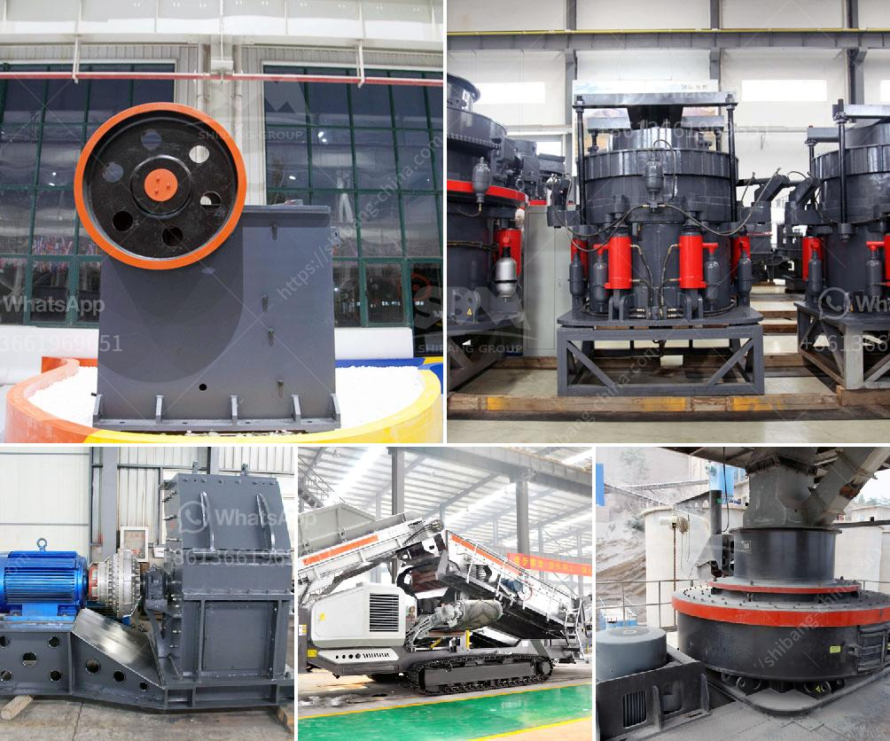

<h3>clay grinding machine price list in andhra pradesh</h3>
Clay grinding machines in India possess a wide range of applications and are commonly used in construction industry for constructing buildings and roads. The clay grinding machine price in Andhra Pradesh, India is quite reasonable. With the usage of this kind of equipment, both the grinding process and maintenance are smooth and convenient for operation.

Before grinding, it is necessary to prepare the clay by mixing it with water to achieve the desired consistency. This process is often carried out in grinding machines, including ball mills, hammer mills, and vertical roller mills. Each grinding machine has unique features and is suitable for various applications depending on the specific requirements of the customers.

When it comes to the clay grinding machine price in Andhra Pradesh, it greatly depends on the type, capacity, and technical specifications of the machine. Higher capacity machines tend to be more expensive, but they can also process larger quantities of clay in a shorter amount of time. On the other hand, smaller capacity machines are more affordable and ideal for customers with lower production demands.

In Andhra Pradesh, where clay grinding machines are widely used, there are many manufacturers and suppliers of these machines. They offer different models with varying prices based on the features and capacities. It is recommended for customers to compare prices and specifications from multiple suppliers before making a purchasing decision.

In addition to the initial price, it is important to consider the ongoing maintenance and operating costs. Some machines require more frequent maintenance and replacement of parts, which can increase the overall cost over time. Customers should also factor in the energy consumption of the machine, as energy-efficient models can help reduce long-term expenses.

Apart from the price, customers should also pay attention to the quality of the clay grinding machine. It is advisable to choose machines from reputable manufacturers that have a track record of producing reliable and durable equipment. By investing in a high-quality machine, customers can ensure its longevity and minimize the chances of breakdown or malfunction.

To conclude, the clay grinding machine price in Andhra Pradesh varies depending on the type, capacity, and technical specifications of the machine. Customers should carefully compare prices and consider the ongoing maintenance and operating costs to make an informed decision. Additionally, it is important to prioritize quality and choose machines from reputable manufacturers to ensure long-term reliability and durability.
<h3>Contact us</h3><ul><li><strong>Whatsapp:&nbsp;<a href="https://wa.me/8613661969651">+8613661969651</a></strong></li><li><a href="https://swt.shibang-china.com/?git&amp;zhl&amp;clay grinding machine price list in andhra pradesh"><strong>Online Service(chat now)</strong></a></li></ul><h3>Related</h3><ul><li><a href='ball mill manufacturer in sri lanka.md'>ball mill manufacturer in sri lanka</a></li><li><a href='rock crushing limpopo.md'>rock crushing limpopo</a></li><li><a href='prices stone crusher machine.md'>prices stone crusher machine</a></li><li><a href='kaolin clay processing flow chart.md'>kaolin clay processing flow chart</a></li><li><a href='working principle of pebble mill.md'>working principle of pebble mill</a></li></ul>