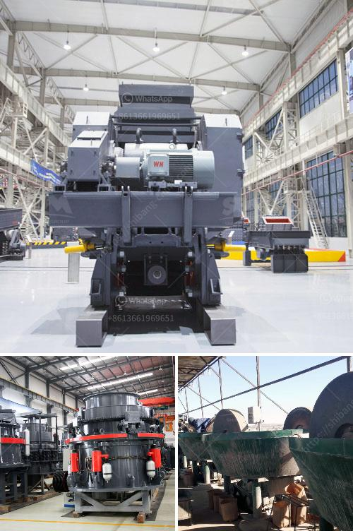

<h3>clay grinding mill</h3>
Clay is a widely used building material with a long history of being molded into various shapes and sizes. Clay bricks and tiles are the most commonly used construction materials, and clay powder plays a vital role in creating ceramics. Clay minerals are also used to manufacture various products, including pharmaceuticals, cosmetics, and even food additives.

To produce clay powder, clay needs to be ground into a fine powder form. Grinding clay can be a tedious process, especially when large quantities of clay are involved. Thankfully, clay grinding mills are now available to simplify this process. These mills are specialized machines designed to grind and pulverize clay into fine powder. They are commonly used in the ceramic, pottery, and tile industries, where clay is extensively used.

The clay grinding mill consists of a rotating cylinder that is partially filled with grinding media (balls), which are made of steel or ceramic materials. The rotating of the cylinder causes the balls to fall back onto the clay material, crushing and pulverizing it into fine particles. The pulverized clay particles are then collected in a container or bag for further processing.

The advantages of using a clay grinding mill are numerous. Firstly, it saves time and effort. Grinding clay by hand can be an arduous task, requiring physical exertion and consuming precious time. With a clay grinding mill, the process is automated, allowing for consistent and efficient grinding of clay.

Secondly, a clay grinding mill ensures the purity of the clay powder. During the grinding process, contaminants and impurities are removed, resulting in a pure clay powder that is free from any unwanted materials. This purity is essential for the production of high-quality ceramics, pottery, and other clay-based products.

Additionally, a clay grinding mill allows for the customization of the clay powder. Different materials can be added during the grinding process to alter the properties of the clay powder. By adjusting the grinding conditions and parameters, specific particle sizes can also be achieved to meet varying requirements.

Moreover, clay grinding mills are environmentally friendly. The machines are designed to minimize dust and noise pollution, ensuring a safe and clean working environment. Furthermore, the energy consumption of clay grinding mills is relatively low, reducing overall energy costs.

In conclusion, a clay grinding mill is a valuable asset for any business involved in clay processing or ceramics production. It can significantly streamline the process of grinding clay, resulting in time and cost savings. Moreover, the purity and customization possibilities offered by a clay grinding mill enhance the quality of the final clay products. As the demand for clay-based products continues to rise, investing in a clay grinding mill is a wise choice for businesses looking to stay competitive in the market.
<h3>Contact us</h3><ul><li><strong>Whatsapp:&nbsp;<a href="https://wa.me/8613661969651">+8613661969651</a></strong></li><li><a href="https://swt.shibang-china.com/?git&amp;zhl&amp;clay grinding mill"><strong>Online Service(chat now)</strong></a></li></ul><h3>Related</h3><ul><li><a href='rock crushing machine for sale.md'>rock crushing machine for sale</a></li><li><a href='used concrete ready mix plant price.md'>used concrete ready mix plant price</a></li><li><a href='india edible clay making process.md'>india edible clay making process</a></li><li><a href='sand screening machine philippines.md'>sand screening machine philippines</a></li><li><a href='how to grind silica sand.md'>how to grind silica sand</a></li></ul>