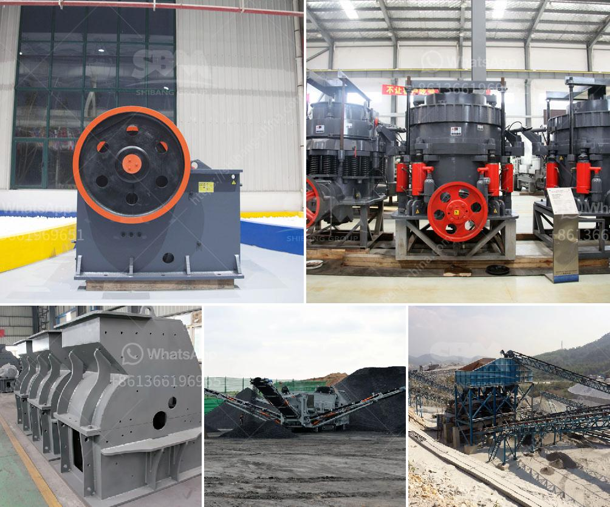

<h3>clay processing clay processing south africa</h3>
Clay processing in South Africa is a significant industry that contributes to the country's economic growth and stability. With its rich natural resources and skilled workforce, South Africa has become a major player in the global clay processing market.

Clay is a versatile material with various uses across different industries. It is primarily composed of fine-grained minerals and organic matter, making it ideal for creating pottery, ceramics, and bricks. The clay processing industry in South Africa involves extracting and processing clay from various deposits, refining it into a usable form, and manufacturing a wide range of products.

One of the key benefits of clay processing in South Africa is its contribution to job creation and poverty alleviation. Many rural communities in South Africa have clay deposits in their vicinity, and locals can engage in clay extraction and processing as a means of income generation. This decentralized approach not only provides employment opportunities but also uplifts marginalized communities by fostering economic development.

The clay processing industry in South Africa also supports other sectors such as construction, agriculture, and art. Clay bricks, for example, are widely used in construction due to their strength, durability, and insulation properties. The demand for bricks in the housing and infrastructure sectors drives the growth of the clay processing industry. In agriculture, clay is used in soil conditioning to enhance fertility and moisture retention, improving crop yields. Moreover, clay is a popular material for artists and potters due to its malleability and ability to retain intricate shapes and designs.

The process of clay processing in South Africa begins with the extraction of clay deposits from mining sites. These deposits are usually found near riverbeds or in open pits. The extracted clay is then transported to processing plants where it undergoes various stages of refinement. This includes crushing, grinding, and screening to remove impurities and achieve the desired particle size. In some cases, the clay is further processed through methods like water washing or chemical treatments before it is ready for manufacturing.

The manufactured clay products from South Africa's clay processing industry are exported to both regional and international markets. The country's strong manufacturing capabilities and adherence to international quality standards have allowed it to establish itself as a reliable supplier of clay products. South African clay products are extensively used in neighboring countries, as well as in global markets such as Europe and North America.

However, like any industry, clay processing in South Africa also faces certain challenges. The mining and processing of clay can have environmental implications such as soil erosion and water contamination. Responsible mining practices and stringent environmental regulations are crucial to mitigate these impacts and ensure sustainable clay processing.

In conclusion, clay processing in South Africa is a vital sector that contributes to the country's overall development. The industry provides employment opportunities, supports other sectors, and promotes economic growth. With proper environmental management and investment in research and development, South Africa's clay processing industry has the potential for further growth and innovation, making it a valuable player in the global clay market.
<h3>Contact us</h3><ul><li><strong>Whatsapp:&nbsp;<a href="https://wa.me/8613661969651">+8613661969651</a></strong></li><li><a href="https://swt.shibang-china.com/?git&amp;zhl&amp;clay processing clay processing south africa"><strong>Online Service(chat now)</strong></a></li></ul><h3>Related</h3><ul><li><a href='silica sand washing dry process.md'>silica sand washing dry process</a></li><li><a href='mini rock crushers.md'>mini rock crushers</a></li><li><a href='sand making machine suppliers in south africa.md'>sand making machine suppliers in south africa</a></li><li><a href='crusher machine for sale in nepal.md'>crusher machine for sale in nepal</a></li><li><a href='mini cone crusher price used.md'>mini cone crusher price used</a></li></ul>