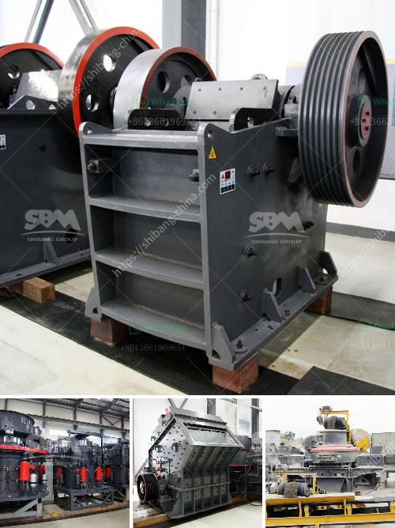

<h3>clinker grinding machine</h3>
Clinker grinding machine is a vital link in the cement production line and the most energy-intensive process. The main function of clinker grinding machine is to grind cement clinker into powder to make cement. The grinding equipment currently used in the production line mainly includes ball mill, cement mill, vertical mill, Raymond mill, etc.

As the main equipment in the cement production line, clinker grinding machine is often used for first crushing and then grinding all kinds of ores and other grindable materials in cement, silicate product, refractory, fertilizer, glass and other industries. With the continuous development of cement production technology and equipment, the grinding technology of clinker grinding machine is also constantly improving, making the clinker grinding process more energy-efficient and environmentally friendly.

One of the most energy-efficient and widely used clinker grinding machines is the ball mill. It is a horizontal cylindrical rotating device with external gear drive, two warehouses, and lattice ball mill. The material enters the first silo of the mill uniformly through the feeding device through the hollow shaft spiral. There are stepped liners or corrugated liners in the silo, containing steel balls of different specifications. The centrifugal force generated by the rotation of the cylinder brings the steel balls to a certain height and then falls down, thereby causing heavy impact and grinding on the material.

Compared with other clinker grinding machines, the ball mill has the advantages of simple structure, reliable operation and low operating cost. It has been widely used in cement, metallurgy, chemical industry, electric power and other industries. In the cement production line, the ball mill is often used to grind various ores and other materials, such as limestone, slag, coal, etc.

Cement mill is another commonly used clinker grinding machine in cement plants. Compared with the ball mill, it has different working principles and structural forms. The grinding medium of cement mill is mainly steel ball, which can grind the materials through the collision and grinding between the steel balls and the materials. Cement mill has the advantages of high grinding efficiency, large output, and low power consumption, which can simplify the grinding process and reduce investment costs.

In addition to traditional clinker grinding machines such as ball mills and cement mills, there are also many innovative grinding machines emerging in recent years. For example, vertical roller mill (VRM) has the advantages of high grinding efficiency, low power consumption, large drying capacity, simple process flow, and small floor space. It is widely used in the grinding of cement raw materials, clinker, and various ores.

With the continuous development of clinker grinding technology, grinding machines are continually improving and evolving. In the future, clinker grinding machines are expected to become more efficient, energy-saving, and environmentally friendly. It will be interesting to see what new innovations will be introduced to the field of clinker grinding machines and how they will impact the cement production industry.
<h3>Contact us</h3><ul><li><strong>Whatsapp:&nbsp;<a href="https://wa.me/8613661969651">+8613661969651</a></strong></li><li><a href="https://swt.shibang-china.com/?git&amp;zhl&amp;clinker grinding machine"><strong>Online Service(chat now)</strong></a></li></ul><h3>Related</h3><ul><li><a href='dolomite grinding machines suppliers in india.md'>dolomite grinding machines suppliers in india</a></li><li><a href='dolomite process peritidal subtidal.md'>dolomite process peritidal subtidal</a></li><li><a href='graphite production line.md'>graphite production line</a></li><li><a href='primary crusher ball milling pengertian.md'>primary crusher ball milling pengertian</a></li><li><a href='recycled glass countertops south africa.md'>recycled glass countertops south africa</a></li></ul>