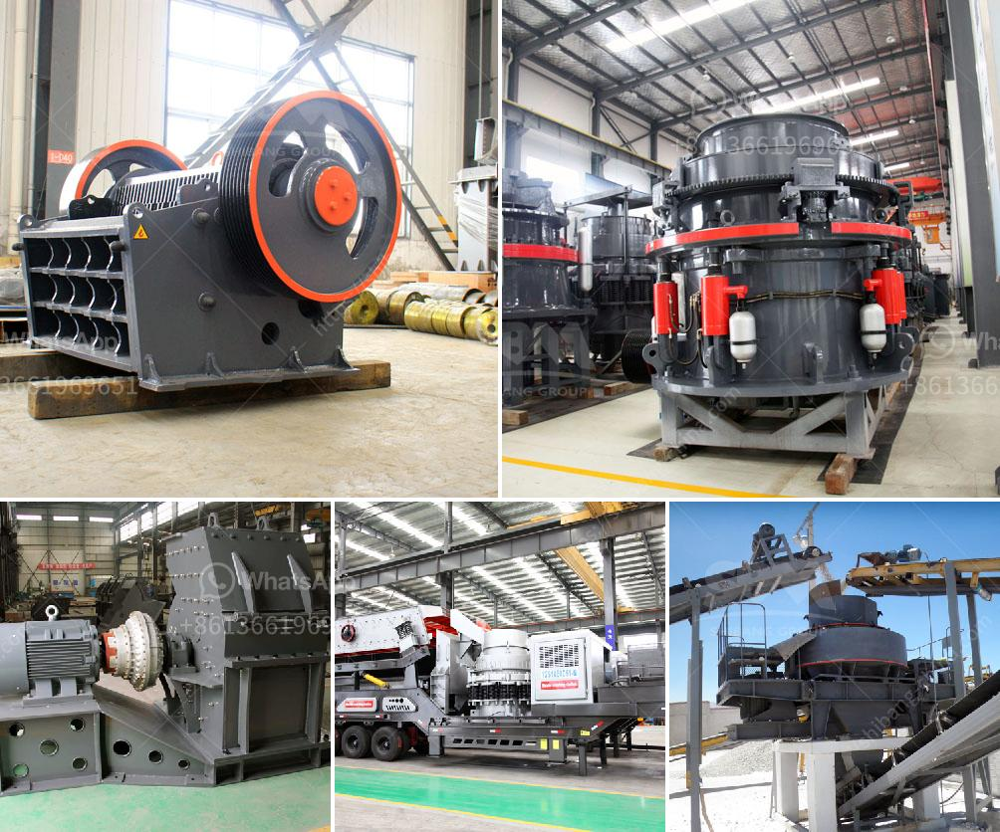

<h3>coal and iron ore mining business plan pdf</h3>
Coal and iron ore mining business plan pdf - One of the most lucrative businesses you can set up is a coal and iron ore mining business. The demand for coal and iron ore has been on the rise, and will continue to thrive as the world's population continues to increase. Coal is used in several industries, including power generation, steel production, and cement manufacturing, making it a valuable resource.

To start a coal and iron ore mining business, you will need a significant amount of capital to purchase equipment and secure licenses and permits. It is important to conduct thorough research to determine the feasibility of your venture and create a detailed business plan.

A business plan is essential as it serves as a roadmap for your operations. It outlines your goals, target market, competition, marketing strategies, financial projections, and contingency plans. A well-structured business plan will not only help you secure funding but will also guide you throughout your journey.

The first step in creating a coal and iron ore mining business plan is conducting a comprehensive market analysis. This includes identifying your target market and understanding its size, growth potential, and trends. You should also evaluate your competition to identify their strengths, weaknesses, and unique selling propositions.

Once you have a thorough understanding of the market, you can establish your business objectives. This includes defining your vision, mission, and core values. Additionally, you should outline your short-term and long-term goals and create actionable strategies to achieve them.

The next section of your business plan should focus on your marketing and sales strategies. This includes determining your pricing strategy, distribution channels, and advertising tactics. You should also identify potential partnerships and collaborations to expand your reach and increase sales.

Managing your finances is crucial for the success of your coal and iron ore mining business. In this section, you should create a detailed budget outlining your estimated expenses and projected revenue. It is also important to conduct a financial analysis to assess the profitability of your venture. This includes calculating the break-even point, return on investment, and payback period.

Another critical aspect of your business plan is addressing operational concerns. This includes outlining your mining processes, equipment needs, and workforce requirements. It is crucial to prioritize safety measures and sustainability practices to ensure the longevity of your operations.

Finally, you should include a risk management and contingency plan. This involves identifying potential risks and developing strategies to mitigate them. You should also consider the potential impact of external factors, such as changes in government regulations or fluctuations in commodity prices.

In conclusion, a coal and iron ore mining business can be a profitable venture for entrepreneurs who are willing to invest time and resources. Creating a business plan is crucial to outline your goals, strategies, and financial projections. It is vital to conduct thorough market research, develop robust marketing and sales strategies, and establish efficient operational processes. With careful planning and execution, your coal and iron ore mining business can thrive in the global market.
<h3>Contact us</h3><ul><li><strong>Whatsapp:&nbsp;<a href="https://wa.me/8613661969651">+8613661969651</a></strong></li><li><a href="https://swt.shibang-china.com/?git&amp;zhl&amp;coal and iron ore mining business plan pdf"><strong>Online Service(chat now)</strong></a></li></ul><h3>Related</h3><ul><li><a href='copper mining and crusher processing in zambia.md'>copper mining and crusher processing in zambia</a></li><li><a href='used portable crusher for sale in germany.md'>used portable crusher for sale in germany</a></li><li><a href='jual jaw crusher bekas surabaya.md'>jual jaw crusher bekas surabaya</a></li><li><a href='price of roller crusher.md'>price of roller crusher</a></li><li><a href='component and processes of cement.md'>component and processes of cement</a></li></ul>