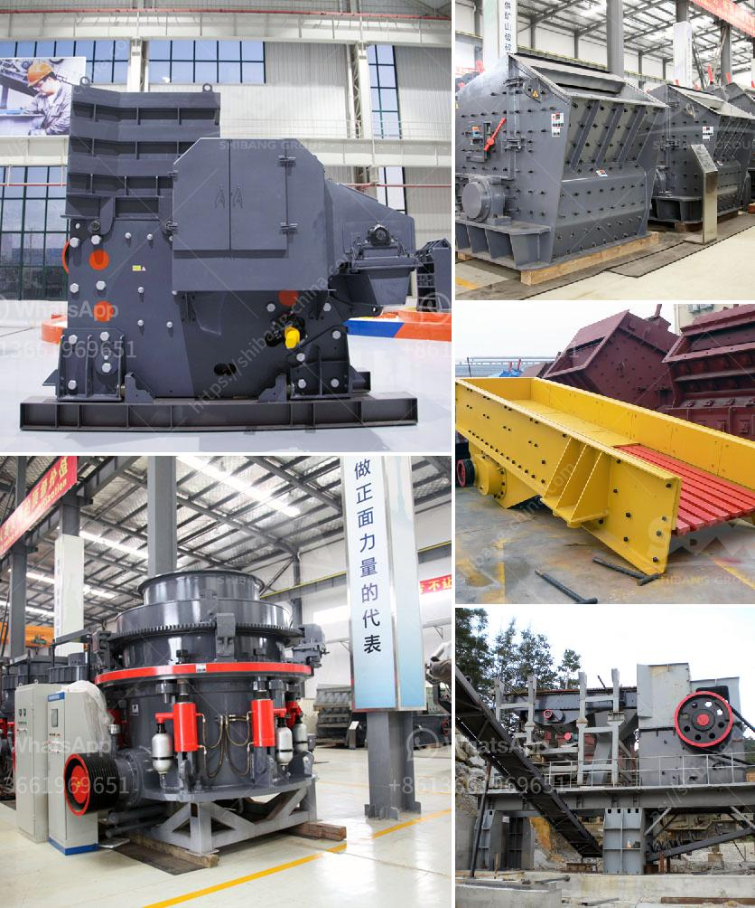

<h3>coal crusher and screening plants for sale</h3>
Coal, a fossil fuel formed over millions of years from decaying plant matter, has been a fundamental energy source for centuries. However, as the world becomes more environmentally conscious, there has been a shift towards cleaner and more sustainable alternatives. Despite this, coal still plays a significant role in many industries, particularly in power generation. To ensure optimal coal utilization, the need for coal crushers and screening plants persist.

Coal crushers are machines that utilize impact, shear, compression, or abrasion to reduce coal size. They are commonly used in primary or secondary crushing, alongside screening plants to separate the desired coal fraction from unwanted minerals and impurities. These crushers offer numerous benefits, including high crushing efficiency, low power consumption, and low maintenance requirements.

In addition to crushers, screening plants are crucial in coal processing. They effectively segregate coal particles, ensuring uniformity in size and eliminating undersized or oversized coal fractions. By doing so, screening plants enable efficient combustion, which contributes to reduced emissions and increased energy efficiency.

For industries in need of coal crushers and screening plants, there are plenty of options in the market. Investing in such equipment can significantly streamline coal processing operations, ensuring a consistent supply of high-quality coal. With technological advancements, modern crushers and screening plants are designed to be more efficient, durable, and environmentally friendly than ever before.

When searching for coal crushers and screening plants for sale, it is essential to consider various factors. Firstly, the specific requirements of the operation, such as desired capacity, particle size range, and the type of coal being processed, should be determined. Additionally, the reputation and reliability of the equipment manufacturer should be researched, ensuring that the products adhere to industry standards and regulations.

In conclusion, coal crushers and screening plants continue to be indispensable in various industries reliant on coal. While the world gradually transitions towards cleaner energy sources, the demand for these equipment persists. By investing in high-quality crushers and screening plants, coal processing operations can be optimized, increasing efficiency and reducing environmental impacts.
<h3>Contact us</h3><ul><li><strong>Whatsapp:&nbsp;<a href="https://wa.me/8613661969651">+8613661969651</a></strong></li><li><a href="https://swt.shibang-china.com/?git&amp;zhl&amp;coal crusher and screening plants for sale"><strong>Online Service(chat now)</strong></a></li></ul><h3>Related</h3><ul><li><a href='kaolin clay processing flow chart.md'>kaolin clay processing flow chart</a></li><li><a href='manufacture of a cone crusher.md'>manufacture of a cone crusher</a></li><li><a href='hydraulic jaw crusher 30 x 40.md'>hydraulic jaw crusher 30 x 40</a></li><li><a href='crushers for sale in uae.md'>crushers for sale in uae</a></li><li><a href='best wash plant for gold mining.md'>best wash plant for gold mining</a></li></ul>