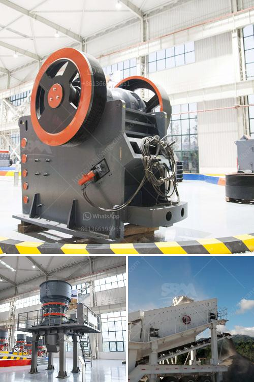

<h3>coal crusher design</h3>
Coal Handling Plants (CHP) in power plants are efficiently designed to meet the boiler fuel requirement for thermal power generation. Coal is an essential material for generating electricity in power plants where it is pulverized and then used as fuel. The process of pulverization converts the coal into a fine powder, which is burned in the combustion chamber to release thermal energy.

One significant stage involved in the coal handling process is the crushing of coal. Coal crushers are designed to reduce the size of coal to a specified size for proper combustion within the boiler. Crushers are typically used to maximize equipment capacity, meet safety regulations, and reduce maintenance downtime.

The coal crusher design is characterized by its robustness and dependability. The machine is designed for continuous operation and equipped with rotating hammers to effectively break down the coal into smaller pieces. To achieve the desired product size, the crushed material passes through a sizing gap between the hammer assembly and adjustable lining plates.

To enhance the safety aspect, coal crushers are equipped with a safety spring mechanism that prevents overload. The spring mechanism absorbs excessive forces by allowing the hammers to give way when they encounter hard material or tramp iron. This minimizes potential damage to the crusher and ensures safe operation.

Efficiency is a key consideration in coal crusher design. The crushing process should break the coal into uniform particles to facilitate combustion and optimize boiler performance. Special attention is given to minimizing the generation of fines, as they may result in ash accumulation and decreased efficiency. The crusher design ensures minimal fines generation by precisely controlling the gap setting and utilizing adjustable grate bars.

Additionally, maintenance and inspection play a crucial role in the design of coal crushers. Access doors are strategically placed to provide easy access to critical components for inspection, cleaning, and maintenance activities. Provisions for grease lubrication and dust suppression systems are incorporated to minimize wear and prevent dust emissions.

In conclusion, a well-designed coal crusher contributes to efficient coal handling and improved combustion in power plants. Robustness, reliability, safety, efficiency, and ease of maintenance are key considerations in the design of these machines. By incorporating these features, coal crushers ensure the supply of clean and appropriately sized coal for optimal power generation.
<h3>Contact us</h3><ul><li><strong>Whatsapp:&nbsp;<a href="https://wa.me/8613661969651">+8613661969651</a></strong></li><li><a href="https://swt.shibang-china.com/?git&amp;zhl&amp;coal crusher design"><strong>Online Service(chat now)</strong></a></li></ul><h3>Related</h3><ul><li><a href='ball mill grinding in malaysia.md'>ball mill grinding in malaysia</a></li><li><a href='business plan for small scale chrome mining crusher.md'>business plan for small scale chrome mining crusher</a></li><li><a href='gold refining equipment for sale.md'>gold refining equipment for sale</a></li><li><a href='rock cone crushers.md'>rock cone crushers</a></li><li><a href='calcium carbonate crushers.md'>calcium carbonate crushers</a></li></ul>