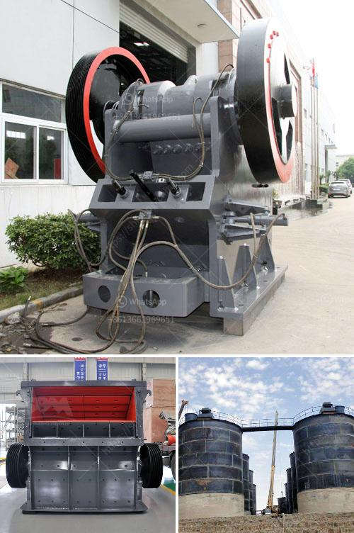

<h3>coal crusher hammer</h3>
Coal Crusher Hammer: The coal crusher hammer, also called coal crusher hammerhead, is a key component of the coal crusher machine. Hammer mill crushers have a significant effect on the efficiency of coal crushers, causing significant wear and tear.

Typically, coal crushers are worn out quickly during the crushing process due to their exposure to high temperatures and abrasive materials. However, the proper design and material selection of the coal crusher hammer can prolong its service life and improve efficiency.

Coal crusher hammers are typically made of high manganese steel and high chromium cast iron. These materials have good wear resistance and allow the hammer to withstand high temperatures. However, inappropriate material selection may cause the hammer to wear quickly.

To maximize the service life of the coal crusher hammer, proper material selection is crucial. The coal crusher hammer should have the following characteristics:

1. High hardness: The hammerhead of the coal crusher adopts a high-hardness material. It ensures that the hammerhead can withstand the crushing of coal, limestone, and other materials throughout its service life.

2. High toughness: The coal crusher hammer should have high toughness. It can absorb impact energy effectively and reduce cracking caused by hammerhead impact.

3. Good anti-wear properties: The coal crusher hammer should have excellent wear resistance to ensure the reliable operation of the coal crusher.

4. Low maintenance requirements: The coal crusher hammer should have a low maintenance requirement. It can reduce the frequency of hammer replacement and ensure the continuous operation of the coal crusher.

Appropriate heat treatment techniques can improve the performance of the coal crusher hammer. Heat treatment techniques like quenching and tempering can significantly enhance the hardness and toughness of the hammerhead.

In addition to proper material selection and heat treatment, regular maintenance is necessary to prolong the service life of the coal crusher hammer. Routine inspection, including checking the hammer's wear condition and fixing or replacing it timely, is essential.

In conclusion, the coal crusher hammer plays a crucial role in the crushing operation of coal. Proper material selection, heat treatment, and regular maintenance are necessary to ensure the efficient and reliable operation of the coal crusher. Good design and proper operation will help extend the service life of the coal crusher hammer and reduce maintenance costs.
<h3>Contact us</h3><ul><li><strong>Whatsapp:&nbsp;<a href="https://wa.me/8613661969651">+8613661969651</a></strong></li><li><a href="https://swt.shibang-china.com/?git&amp;zhl&amp;coal crusher hammer"><strong>Online Service(chat now)</strong></a></li></ul><h3>Related</h3><ul><li><a href='jaw crushers price south africa.md'>jaw crushers price south africa</a></li><li><a href='conveyor belt manufacturers in bangladesh.md'>conveyor belt manufacturers in bangladesh</a></li><li><a href='quartz crusher machinery.md'>quartz crusher machinery</a></li><li><a href='quotation ball mill.md'>quotation ball mill</a></li><li><a href='jaw crusher adalah.md'>jaw crusher adalah</a></li></ul>