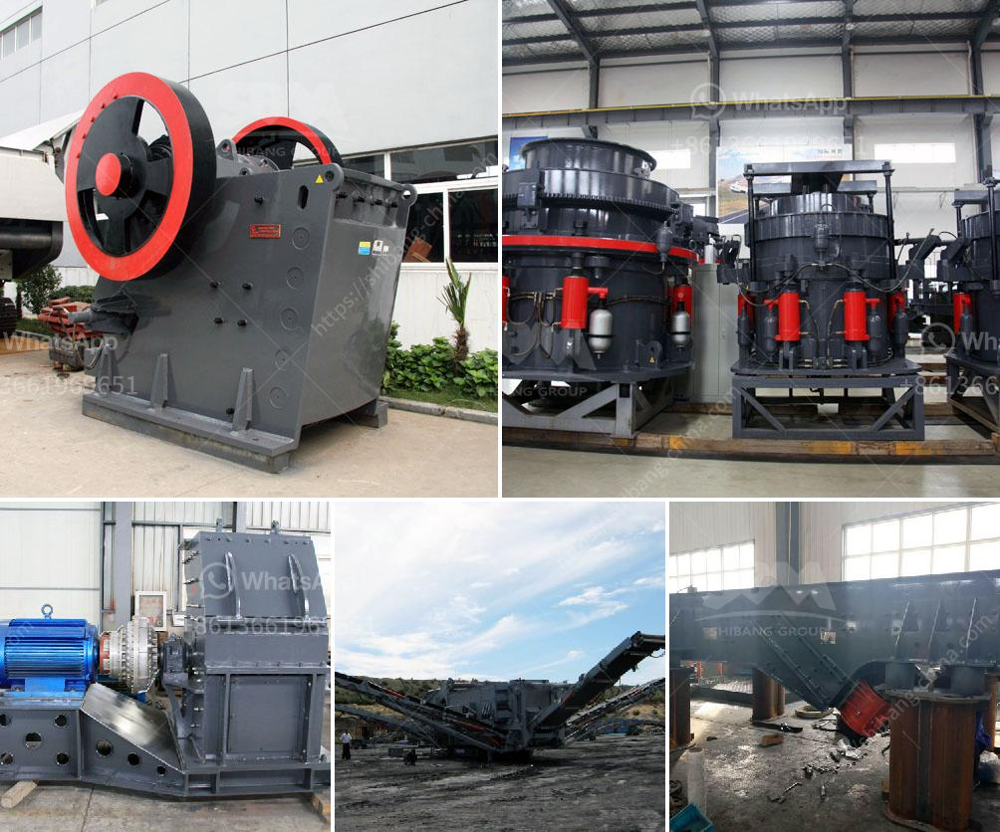

<h3>coal crusher machine pdf</h3>
A coal crusher machine is a machine utilized in the crushing process of coal into smaller sizes for processing in the different industries like solid waste recycling, mining, cement production, and similar industries. In general, all types of jaw crushers are designed to crush hard materials efficiently and effectively to achieve the desired size reduction. The machine consists of a fixed jaw and a moving jaw, both of which are attached to a vertical or horizontal shaft. The movement of the jaws creates compressive forces that crush the coal.

One common type of coal crusher machine is a single toggle jaw crusher, where the two jaws are fixed and the moving jaw squeezes and crushes the coal between them. The moving jaw is mounted on an eccentric shaft that rotates at high speed, compressing the coal against the fixed jaw. This type of coal crusher machine is known to produce a relatively uniform particle size distribution with minimal fines.

Another type of coal crusher machine is a reversible hammer mill crusher, which is considered as the secondary crusher in most coal processing plants. Reversible hammer mill crushers are known for their reliability and flexibility in crushing materials. They can take on a wide range of materials such as coal, limestone, clay, shale, etc., and can also handle wet and sticky materials. These machines can crush the coal into finer particles by reversible actions, allowing both primary and secondary crushing operations.

One important feature of a coal crusher machine is its ability to handle large feed sizes. Coal usually comes from mines in large chunks, and the coal crusher machine must be able to accept those large chunks and reduce them to manageable sizes. Therefore, the coal crusher machine should have a larger feed opening to accommodate the larger feed sizes. This feature ensures that the machine operates efficiently and does not get clogged or overloaded.

In addition to the primary crushing functions, coal crusher machines may also have additional features to enhance their performance. Some coal crusher machines may have a vibrating screen attached to separate the coal particles of different sizes and remove any impurities. This vibrating screen helps to ensure that the coal being processed is of high quality and suitable for further industrial use.

In conclusion, a coal crusher machine is an essential part of any coal processing plant. It is used to crush coal into smaller sizes for further processing in various industries. Coal crusher machines come in different types, such as jaw crushers and hammer mills, which handle coal differently. Each type of coal crusher machine has its specific advantages and disadvantages, but all of them have the common goal of efficiently crushing the coal and producing a uniform particle size distribution.
<h3>Contact us</h3><ul><li><strong>Whatsapp:&nbsp;<a href="https://wa.me/8613661969651">+8613661969651</a></strong></li><li><a href="https://swt.shibang-china.com/?git&amp;zhl&amp;coal crusher machine pdf"><strong>Online Service(chat now)</strong></a></li></ul><h3>Related</h3><ul><li><a href='marble quarry crusher equipments.md'>marble quarry crusher equipments</a></li><li><a href='granite crusher cost.md'>granite crusher cost</a></li><li><a href='gypsum processing line.md'>gypsum processing line</a></li><li><a href='cement grinding mills.md'>cement grinding mills</a></li><li><a href='aggregate stone crusher price south africa.md'>aggregate stone crusher price south africa</a></li></ul>