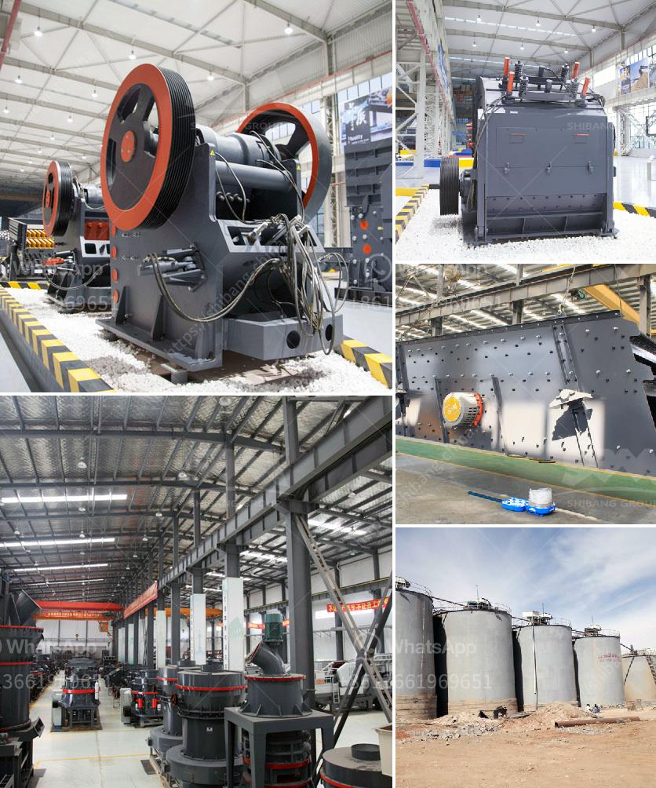

<h3>coal crushing and washing plant sale south africa</h3>
Coal crushing and washing plant for sale in South Africa is a highly competitive industry today, as investors are seeking to increase efficiency and reduce operating costs.

Coal crushing and washing plant for sale in South Africa not only offers flexibility in mining operations but also ensures cost-effective particle size distribution, thus eliminating the need for further cost-intensive grinding operations.

According to experts, South Africa's coal crushing and washing plant sales market's annual total output has increased steadily from 2004 to 2011. The industry with the largest output growth rate is the automobile manufacturing industry, accounting for 4.1% of the industry's annual total output.

In recent years, the vertical mill industry's development is very rapidly, which drives the economic development of South Africa coal crushing and washing plant sales market. The emerging coal crushing and washing plant market in South Africa is a major contributor to the economy of this country.

As South Africa's largest producer of mining machinery, SBM has always been committed to the production and development of various mining equipment, such as crushers, sand making machines, vibrating screeners, etc., including energy-saving and environmental-friendly crushing and sand making equipment for crushing and washing of coal.

According to the requirements of customers, SBM can combine various types of crushing equipment to meet different process requirements, crushing and washing plant for coal mining industry, such as jaw crushers, cone crushers, impact crushers, hammer crushers, etc., coal crushing and washing line can be customized according to customers' requirements.

Coal crushing and washing plant for sale in South Africa has a highly competitive structure, well-functioning machinery, and a clear-cut purpose. This makes it easy to operate and maintain, and ensures the better efficiency of the plant operations.

Coal crushing and washing plant for sale in South Africa provides a reliable solution for mining operations specifically designed for the complex conditions and harsh environments often found in coal mining operations. These include the factors such as stripping ratio, rock strength, weathering patterns, and geographical variations.

Coal crushing and washing plant for sale in South Africa is a complex and energy-intensive process. The process includes crushing, grinding, and beneficiation. Such three-stage crushing process can be applied into high-hardness materials, which can crush the materials in size order, saving time and improving efficiency.

In order to meet the increasing demand for energy, South Africa has made great efforts and made progress in the development and utilization of coal resources. The coal crushing and washing plant for sale in South Africa is a device that has built a number of coal-fired power plants, which greatly increased coal reserves in the country. So, it is necessary to invest in this industry.

To sum up, coal crushing and washing plant for sale in South Africa is a highly competitive industry, which not only follows the needs of the market but also continuously developing to meet customer's needs. It can be predicted that the industry will continue to develop and take a leading position in the future's energy field.
<h3>Contact us</h3><ul><li><strong>Whatsapp:&nbsp;<a href="https://wa.me/8613661969651">+8613661969651</a></strong></li><li><a href="https://swt.shibang-china.com/?git&amp;zhl&amp;coal crushing and washing plant sale south africa"><strong>Online Service(chat now)</strong></a></li></ul><h3>Related</h3><ul><li><a href='grinding machines for brick.md'>grinding machines for brick</a></li><li><a href='feasibility study for stone crusher plants.md'>feasibility study for stone crusher plants</a></li><li><a href='diagram of stone crusher operation.md'>diagram of stone crusher operation</a></li><li><a href='kaolin grinding mill.md'>kaolin grinding mill</a></li><li><a href='how to machine limestone.md'>how to machine limestone</a></li></ul>