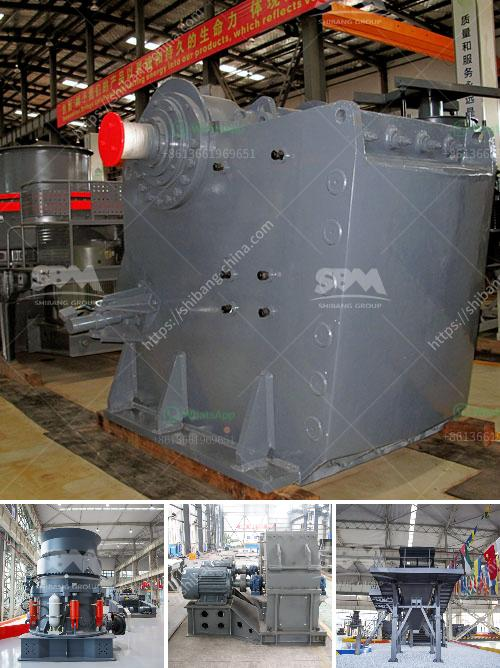

<h3>coal dryer manufacturer india</h3>
India, known for its rich reserves of coal, has witnessed rapid industrialization in recent years. As the demand for coal continues to increase, so does the need for efficient and sustainable methods of processing and utilizing this valuable natural resource. This is where coal dryer manufacturers in India play a crucial role.

The conventional method of drying coal involves exposing it to the open atmosphere, which can be time-consuming, inefficient, and environmentally hazardous. Coal dryers, manufactured by specialized companies, are designed to overcome these challenges by offering a faster, more efficient, and environmentally friendly alternative.

One such prominent player in the market is the coal dryer manufacturer. With decades of experience in the industry, they have established themselves as a reliable and innovative solution provider for the drying of coal. Their advanced coal drying technology has revolutionized the way coal is processed and utilized in various industries.

The coal dryers offered by these manufacturers are designed to remove moisture from coal, enhancing its calorific value and making it more suitable for applications like power generation, cement production, and steel manufacturing. The drying process significantly reduces the moisture content in coal, thereby enhancing its combustion efficiency while minimizing pollution levels.

These coal dryers come in various capacities to cater to the diverse needs of different industries. They are equipped with state-of-the-art features like high-speed centrifugal fans, advanced temperature control systems, and efficient dust collectors to ensure optimal drying efficiency and minimize environmental impact.

One of the significant advantages of utilizing coal dryers manufactured in India is their cost-effectiveness. These dryers offer a high return on investment due to their energy-saving capabilities and low operational costs. By reducing the moisture content in coal, they improve its heating value, resulting in reduced coal consumption and increased cost savings for industries.

Furthermore, the advanced technology employed in these dryers ensures that the drying process is carried out in a sustainable and environmentally friendly manner. They are designed to minimize carbon emissions and other pollutants, making them compliant with strict environmental regulations.

Additionally, coal dryer manufacturers in India prioritize customer satisfaction and offer comprehensive solutions that include installation, commissioning, and after-sales support. This ensures a seamless integration of their dryers into the existing operations of industries, resulting in minimal downtime and enhanced productivity.

The coal dryer market in India is witnessing significant growth due to the increasing demand for processed coal in industries. The shift towards cleaner and more efficient energy sources has further fueled the adoption of coal drying technology.

In conclusion, coal dryer manufacturers in India play a pivotal role in the country's coal processing industry. Their advanced coal drying technology offers a sustainable, cost-effective, and efficient solution for increasing the calorific value of coal and reducing its moisture content. With their innovative approach and commitment to customer satisfaction, they are driving the transformation of the coal sector, helping industries to meet their energy needs while mitigating environmental impact.
<h3>Contact us</h3><ul><li><strong>Whatsapp:&nbsp;<a href="https://wa.me/8613661969651">+8613661969651</a></strong></li><li><a href="https://swt.shibang-china.com/?git&amp;zhl&amp;coal dryer manufacturer india"><strong>Online Service(chat now)</strong></a></li></ul><h3>Related</h3><ul><li><a href='calcium bromide manufacturing process.md'>calcium bromide manufacturing process</a></li><li><a href='100tph stationery stone crushing plant.md'>100tph stationery stone crushing plant</a></li><li><a href='sand beneficiation plant technology.md'>sand beneficiation plant technology</a></li><li><a href='grinding zeolite ball mill machine.md'>grinding zeolite ball mill machine</a></li><li><a href='cement plant for sale south africa.md'>cement plant for sale south africa</a></li></ul>