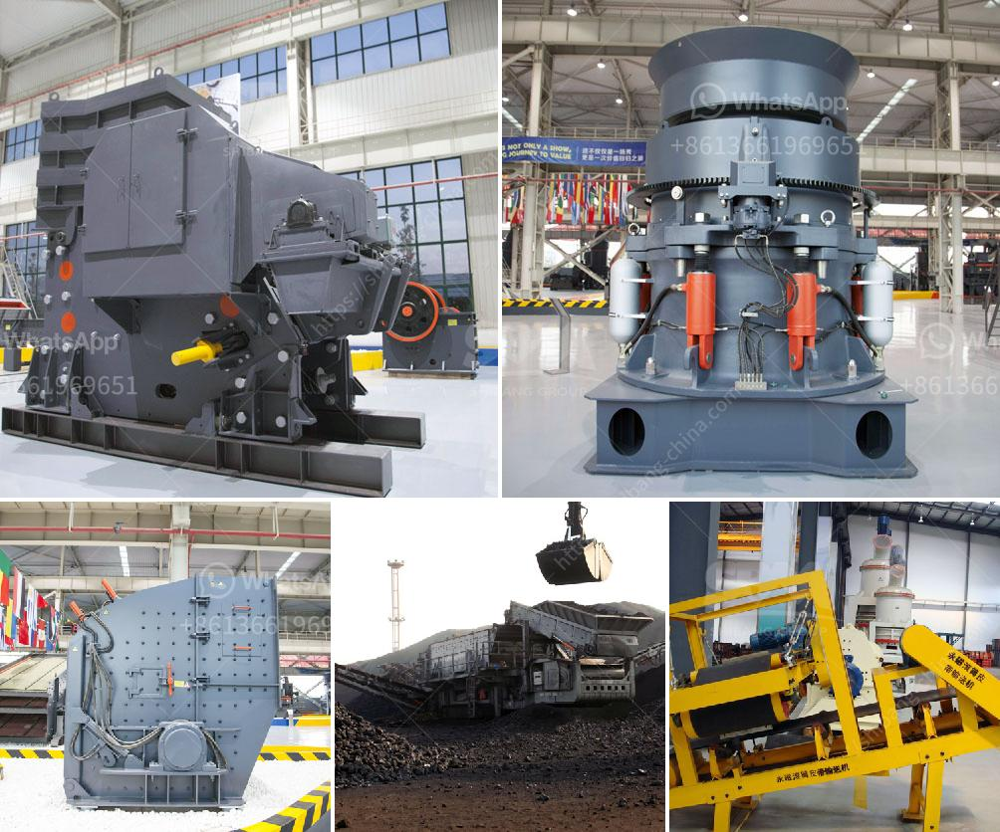

<h3>coal fired power plants contractors in vietnam</h3>
Vietnam's rapid economic growth has resulted in an increased demand for electricity, making the expansion of power generation capacity a top priority for the country. Coal-fired power plants have played a significant role in meeting this growing energy demand. However, the involvement of contractors in building these power plants raises concerns about their environmental and social impacts.

Contractors are vital players in the construction of coal-fired power plants, handling key responsibilities such as engineering, procurement, and construction. These companies are often multinational corporations, renowned for their expertise in energy infrastructure development. Their involvement brings economic benefits, such as job creation and technology transfer, contributing to local development and skills advancement.

Vietnam heavily relies on imported coal to fuel its power plants, and this dependence has its downsides. Burning coal is a major contributor to greenhouse gas emissions and air pollution, posing significant health and environmental risks. Consequently, the participation of contractors in constructing coal-fired power plants raises questions about their commitment to sustainability and the overall environmental impact of these projects.

While some contractors claim to prioritize sustainability, critics argue that their involvement in coal-fired power plants contradicts these claims. These projects not only emit greenhouse gases but also contaminate water sources, negatively impacting local communities and ecosystems. The extraction, transportation, and burning of coal can cause land degradation, deforestation, and the displacement of communities, leading to social and economic disruptions.

Moreover, the construction of coal-fired power plants often faces resistance from environmental activists and affected communities due to health concerns and the long-term consequences for climate change. These concerns have led to legal battles and protests, causing delays and additional costs for contractors. Such opposition highlights the growing awareness and urgency for cleaner and more sustainable energy sources.

To address these concerns, Vietnam's government has been gradually shifting focus towards renewable energy sources, including wind and solar power. While this transition is encouraging, the construction of coal-fired power plants remains a significant part of Vietnam's energy portfolio. The government needs to carefully assess the environmental impact and long-term sustainability of these projects, paying special attention to selecting contractors with the necessary expertise in reducing emissions and mitigating environmental harm.

Furthermore, contractors should work closely with local communities to ensure adequate compensation, social support, and environmental protection. Alongside meeting legal requirements, contractors should voluntarily engage in corporate social responsibility initiatives, aiming to address environmental and social impacts and contribute to the well-being of the affected areas.

The future of Vietnam's energy sector lies in finding a balance between meeting energy demand and minimizing environmental damage. It is crucial for contractors in the coal-fired power sector to actively embrace and invest in clean technologies, such as carbon capture and storage, to limit emissions and minimize ecological footprints.

In conclusion, while coal-fired power plants are still necessary to meet Vietnam's growing energy demand, their construction must prioritize sustainability and environmental responsibility. Contractors involved in these projects should adopt cleaner technologies and engage in meaningful dialogues with local communities, taking steps towards a more sustainable and environmentally conscious energy future for Vietnam.
<h3>Contact us</h3><ul><li><strong>Whatsapp:&nbsp;<a href="https://wa.me/8613661969651">+8613661969651</a></strong></li><li><a href="https://swt.shibang-china.com/?git&amp;zhl&amp;coal fired power plants contractors in vietnam"><strong>Online Service(chat now)</strong></a></li></ul><h3>Related</h3><ul><li><a href='stone crusher price in australia.md'>stone crusher price in australia</a></li><li><a href='portable crusher manufacturer.md'>portable crusher manufacturer</a></li><li><a href='quarry crusher for sales in germany.md'>quarry crusher for sales in germany</a></li><li><a href='sand making machine suppliers in south africa.md'>sand making machine suppliers in south africa</a></li><li><a href='second hand mobile coal washing plant.md'>second hand mobile coal washing plant</a></li></ul>