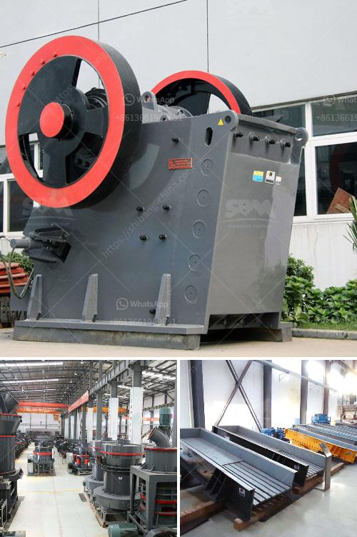

<h3>coal grinding plant</h3>
Coal continues to play a significant role in meeting the global energy demands, despite the increasing shift towards renewable energy sources. To maximize the potential of coal power, efficient and eco-friendly coal grinding plants are essential. This article delves into the benefits and advancements of coal grinding plants, focusing on their efficiency and environmental impact.

Coal grinding plants aim to provide a fine coal dust as a fuel for the combustion process. Through the grinding process, coal particle size is reduced to further enhance combustion efficiency and facilitate clean combustion. The use of finely ground coal ensures optimal combustion, reducing fuel consumption, and minimizing pollutant emissions.

The grinding process also improves the thermal efficiency of the coal power plant. By finely grinding coal, the fuel surface area increases, promoting better heat transfer. This enhanced heat transfer maximizes the utilization of energy, resulting in higher generating capacity and improved plant performance.

1. Pulverizer: A pulverizer is a key component responsible for grinding coal into a fine powder. Modern coal pulverizers are capable of handling various types of coal and have improved grinding efficiency. They consist of multiple grinding rollers and a rotating table, ensuring even coal distribution and constant coal-air ratio.

2. Classifier: The classifier separates the fine coal particles from the coarse ones, ensuring uniform particle size distribution. It directs the coarse particles back to the pulverizer for further grinding, while the fine particles are sent to the furnace for combustion.

3. Cyclone separator: The use of cyclone separators separates the remaining fine coal particles from the flue gas after combustion. This step helps to minimize the emission of fly ash and other pollutants into the environment.

Today's coal grinding plants strive to minimize their environmental impact. Advanced technologies have been incorporated to reduce pollutant emissions, including:

1. Electrostatic precipitators: Electrostatic precipitators are used to collect fly ash and other particulate matter from flue gas. These devices employ high-voltage electrostatic fields to separate and capture the particles, preventing them from being released into the atmosphere.

2. Flue gas desulfurization (FGD) systems: FGD systems remove sulfur dioxide (SO2) from flue gas. This is achieved by employing various chemical reactions to convert SO2 into a harmless byproduct. This technology significantly reduces the emissions of harmful sulfur compounds, mitigating the environmental impact.

Coal grinding plants are crucial in ensuring reliable and efficient energy production. They enable the maximum utilization of coal, resulting in optimized combustion and reduced fuel consumption. With ongoing advancements, coal grinding plants have become more eco-friendly, employing technologies to minimize pollutant emissions. As we transition towards cleaner energy alternatives, efficient coal grinding plants continue to play a vital role in the energy mix, providing a bridge to a more sustainable future.
<h3>Contact us</h3><ul><li><strong>Whatsapp:&nbsp;<a href="https://wa.me/8613661969651">+8613661969651</a></strong></li><li><a href="https://swt.shibang-china.com/?git&amp;zhl&amp;coal grinding plant"><strong>Online Service(chat now)</strong></a></li></ul><h3>Related</h3><ul><li><a href='gypsum recycling plant cost.md'>gypsum recycling plant cost</a></li><li><a href='bentonite pulverizer ball mill in gujrat.md'>bentonite pulverizer ball mill in gujrat</a></li><li><a href='manufacture of a cone crusher.md'>manufacture of a cone crusher</a></li><li><a href='white cement plant machinery manufacturers.md'>white cement plant machinery manufacturers</a></li><li><a href='sale of old hammer crusher.md'>sale of old hammer crusher</a></li></ul>