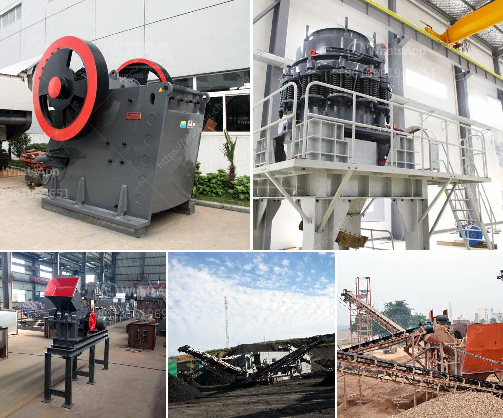

<h3>coal machinery for coal processing crusher</h3>
When it comes to coal processing, the first thing that comes to mind is coal mining. However, coal processing machinery plays an important role in ensuring that the coal extracted from the earth is efficiently processed to be used in various industries. The coal crushing machine is one of the key equipment for coal mining and processing.

A crusher is a machine designed to reduce large rocks into smaller rocks, gravel, sand, or rock dust. Crushers are used to crush large coal pieces into smaller ones that can be used in various industrial applications.

Different types of crushers are used for crushing different types of materials - ranging from soft coal to very hard iron ore. Each type of crusher comes in various sizes, with selection dependent on the requirement of particular capacity, feed, and crushed product size. They can be used for primary, secondary, and tertiary crushing.

Coal crushers are characterized by their simple structure, low operating cost, and easy maintenance, ensuring high productivity with low maintenance costs. They can be easily installed and operate with little technical knowledge.

Coal crushers can be classified into primary crushing, secondary crushing, and tertiary crushing machienes according to production need and final products reqiurements. Following are several popular stone crushers for coal crushing.

Jaw crusher:  Jaw crusher is the essential coal crusher machine in the production line, as its productivity and reliability directly affect the coal mining efficiency. It is ideal equipment for coal preparation.

Teeth roller crusher:  Teeth roller crusher is the traditional coal crusher, integrating rolling and crushing, with the advantages of simple structure and high efficiency. It is widely used in coal mines.

Magnetic separator:  In coal preparation plants, iron removal operations constitute an important part of the process. The magnetic separator is one of the most widely used machines in the industry and it is suitable for separating materials which have magnetism differences.

Magnetic separator transports the coal into the magnetic field area and separates the gangue from the coal. With the help of magnetic force and mechanical force, the coal and gangue minerals are separated during the operation.

In summary, coal processing plants mainly include coal crusher, coal mill, magnetic separator, and other auxiliary equipment. All these machines are used to separate the different sizes of the coal particles, remove debris and other impurities, and wash the coal. In order to get the required coal products, some mining machines are necessary in the coal processing plants, such as vibrating feeder, vibrating screen, and belt conveyor. These machines and equipment cooperate with each other and form a whole coal mining line.
<h3>Contact us</h3><ul><li><strong>Whatsapp:&nbsp;<a href="https://wa.me/8613661969651">+8613661969651</a></strong></li><li><a href="https://swt.shibang-china.com/?git&amp;zhl&amp;coal machinery for coal processing crusher"><strong>Online Service(chat now)</strong></a></li></ul><h3>Related</h3><ul><li><a href='limestone grinding mill.md'>limestone grinding mill</a></li><li><a href='kenya quartz crushing.md'>kenya quartz crushing</a></li><li><a href='jaw crusher engine and complete set.md'>jaw crusher engine and complete set</a></li><li><a href='used copper process plants for sale.md'>used copper process plants for sale</a></li><li><a href='high energy ball mill.md'>high energy ball mill</a></li></ul>