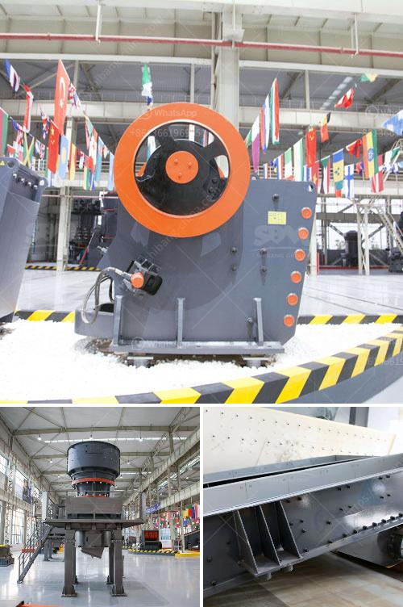

<h3>coal manufacturers pulverizers</h3>
Coal remains a significant energy source across the globe, especially in power generation. To harness the energy contained within coal, it needs to be pulverized into fine particles before being utilized efficiently. This critical step is accomplished by specialized equipment known as coal manufacturers pulverizers.

Coal pulverizers play a crucial role in the production of electricity by efficiently grinding and crushing coal into a fine powder. This powdered coal is then used as fuel in power plants to generate steam, which drives turbines and ultimately produces electricity. Without the pulverization process, coal's energy potential would remain locked.

One of the essential components of a coal pulverizer is the grinding elements, also known as grinding rolls or tires. These components use compression, friction, and impact to crush the coal into smaller particles. The grinding rolls rotate against the grinding ring, causing the coal to be pulverized. The fineness of the coal powder is critical to achieving optimum combustion in the power plant boiler.

Coal manufacturers pulverizers come in various types, including ball mills, impact mills, and vertical mills, depending on the desired particle size and application. Each type has its advantages and disadvantages. Ball mills are known for their versatility and low maintenance requirements, making them suitable for a wide range of coal types. Impact mills are ideal when high-velocity impacts are necessary to pulverize the coal effectively. Vertical mills are commonly used for finer coal grinding and have a higher grinding efficiency.

The selection of the appropriate coal pulverizer depends on several factors, such as the coal's characteristics, the desired coal particle size, and the specific power plant's requirements. Some coal manufacturers pulverizers also offer customization options, allowing power plants to tailor the pulverizer to their specific needs.

In recent years, there has been a growing emphasis on reducing CO2 emissions and increasing the efficiency of coal-fired power plants. As a result, coal manufacturers pulverizers have undergone numerous advancements and technological improvements to meet these demands. For instance, manufacturers are developing pulverizers with higher grinding efficiencies, better fineness control, and lower power consumption. These advancements not only enhance the pulverizer's performance but also contribute to reducing environmental impact.

Maintenance is also a crucial aspect of coal manufacturers pulverizers. Regular inspection, lubrication, and replacement of worn-out parts ensure that the pulverizer operates at peak efficiency and minimizes downtime. Various manufacturers offer maintenance services and spare parts to support power plants in maintaining their pulverizers' reliability and performance.

In conclusion, coal manufacturers pulverizers are vital equipment in power generation that enable the efficient utilization of coal as a primary energy source. Their role in pulverizing coal into fine particles ensures optimal combustion in power plant boilers, thereby generating electricity. With ongoing advancements, coal pulverizers are becoming more efficient, environmentally friendly, and better suited to meet increasing demands. Regular maintenance further ensures the longevity and reliability of these essential components in power plants across the globe.
<h3>Contact us</h3><ul><li><strong>Whatsapp:&nbsp;<a href="https://wa.me/8613661969651">+8613661969651</a></strong></li><li><a href="https://swt.shibang-china.com/?git&amp;zhl&amp;coal manufacturers pulverizers"><strong>Online Service(chat now)</strong></a></li></ul><h3>Related</h3><ul><li><a href='roller mill pictures.md'>roller mill pictures</a></li><li><a href='grinding machine parts and their functions.md'>grinding machine parts and their functions</a></li><li><a href='tph jaw crusher price.md'>tph jaw crusher price</a></li><li><a href='river sand and stone mining at sabah.md'>river sand and stone mining at sabah</a></li><li><a href='kaolin grinding plant manufacturer in india.md'>kaolin grinding plant manufacturer in india</a></li></ul>