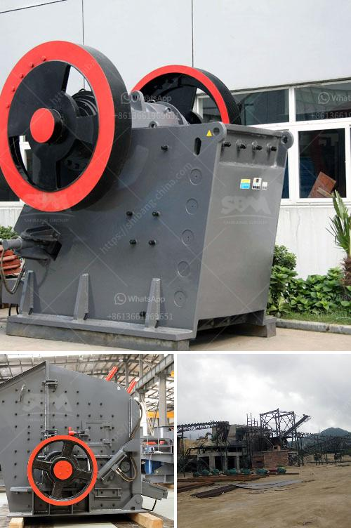

<h3>coal mill in power plant</h3>
Coal mill is one of the most important parts of a coal-fired power plant. It is used to grind and dry the powdered coal and transport it to the boiler for combustion. Coal mill is a major factor affecting the efficiency of a power plant. As a result, it is crucial to optimize its operation for overall performance and cost-effectiveness.

Coal mills are used to transform coal into powdered form in the preparation of coal firing in boilers. This process involves grinding coal (crushed to fine powder) using a rotating mill to generate a high-pressure revolving flow. After that, the powdered coal is blown into the combustion chamber of a boiler, where it is burnt at high temperature to produce heat energy.

The primary function of a coal mill is to control the size of the coal particles in order to increase the efficiency of combustion. The coal particles are ground so that they can be transported easily and burned efficiently in the boiler. Thus, the size of the coal particles affects the overall combustion efficiency and pollutant emissions.

Coal mills consist of several rotating parts, such as grinding plate, grinding ring, hammer, classifier, fan, cyclone separator, and others. These components work together to grind and classify the coal particles based on their size and shape. The grinding process reduces the coal particles' size, making it easier for combustion. On the other hand, the classifier separates the fine particles from the coarse ones, ensuring that only the appropriate size of coal particles enters the combustion chamber.

To optimize the operation of a coal mill, several factors need to be considered. Firstly, the proper grinding pressure and grinding track should be set to ensure the desired fineness of the coal particles. The grinding pressure can be adjusted by controlling the hydraulic cylinder associated with the grinding plate. In addition, the grinding track should be regularly inspected to prevent wear and tear, which can affect the grinding efficiency.

Another important factor is the coal moisture content. If the coal is excessively wet, it can cause difficulties in grinding and transportation. Therefore, the coal should be properly dried before entering the mill. This can be achieved by using hot air from the boiler to evaporate the moisture content in the coal.

Maintenance and inspection of various components of the coal mill are also essential to ensure its efficient operation. Regular inspection of the grinding plate, grinding ring, and hammers can help identify any signs of wear and tear. Replacing these parts when necessary can prevent further damage and decrease the downtime of the mill.

In conclusion, coal mill plays a vital role in the coal-fired power plant. The mill's efficiency directly affects the overall performance of the power plant and its cost effectiveness. With increasing competition in the energy sector and growing concerns about sustainable energy production, it is essential for power plants to optimize their coal milling operations. By monitoring and maintaining various components of the coal mill, power plants can improve their efficiency, reduce fuel consumption, and minimize pollutant emissions.
<h3>Contact us</h3><ul><li><strong>Whatsapp:&nbsp;<a href="https://wa.me/8613661969651">+8613661969651</a></strong></li><li><a href="https://swt.shibang-china.com/?git&amp;zhl&amp;coal mill in power plant"><strong>Online Service(chat now)</strong></a></li></ul><h3>Related</h3><ul><li><a href='rock crusher road construction.md'>rock crusher road construction</a></li><li><a href='gold hammer crusher.md'>gold hammer crusher</a></li><li><a href='jaw crushers price south africa.md'>jaw crushers price south africa</a></li><li><a href='chromite beneficiation plant in malaysia.md'>chromite beneficiation plant in malaysia</a></li><li><a href='sand making machine cost.md'>sand making machine cost</a></li></ul>