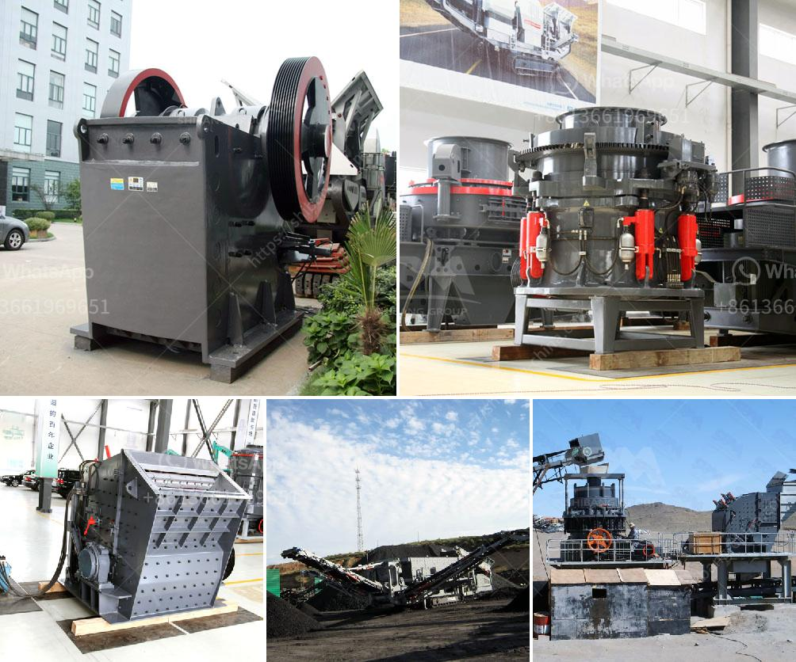

<h3>coal mill outlet temperature</h3>
Coal mills play a crucial role in the power generation process as they help in the smooth and efficient combustion of coal. The coal mill outlet temperature directly impacts the performance of the boiler, which in turn affects the overall power generation efficiency. Understanding the significance of coal mill outlet temperature is crucial for power plant operators to optimize their operations and ensure optimal power generation.

The coal mill outlet temperature is essentially the primary air temperature, which is essential for drying and transporting the pulverized coal from the coal mill to the furnace. It affects several key aspects of the combustion process, including coal burning rate, coal fineness, and coal moisture content.

Firstly, the coal mill outlet temperature affects the coal burning rate, which directly influences the boiler's heat release rate. If the temperature is too low, insufficient heat will be generated, leading to poor combustion efficiency. On the other hand, if the temperature is too high, it can result in overheating and potential damage to the boiler components. Therefore, maintaining an optimal coal mill outlet temperature is crucial to ensure efficient and stable combustion.

Secondly, the coal fineness is also affected by the outlet temperature. Finer coal particles burn more efficiently, providing better heat transfer to the boiler. Thus, controlling the outlet temperature helps in achieving the desired coal fineness, leading to improved combustion efficiency.

Furthermore, the coal mill outlet temperature affects the coal moisture content. High outlet temperatures can cause coal to dry out quickly, resulting in a decrease in moisture content. Adequate moisture content in the coal is necessary for proper combustion, as it aids in maintaining a stable flame and preventing the potential formation of clinker or slag deposits.

To monitor and control the coal mill outlet temperature, power plant operators utilize various instruments like temperature sensors, thermocouples, and closed-loop control systems. These systems enable real-time monitoring and adjustment of the primary air temperature, ensuring that it remains within the desired limits.

In conclusion, the coal mill outlet temperature is a critical parameter that affects the performance of the power generation process. It impacts the coal burning rate, coal fineness, and coal moisture content, all of which directly affect the combustion efficiency and overall power generation efficiency. It is imperative for power plant operators to monitor and control the outlet temperature within optimal limits to ensure efficient and stable combustion, thereby maximizing power output and minimizing emissions.
<h3>Contact us</h3><ul><li><strong>Whatsapp:&nbsp;<a href="https://wa.me/8613661969651">+8613661969651</a></strong></li><li><a href="https://swt.shibang-china.com/?git&amp;zhl&amp;coal mill outlet temperature"><strong>Online Service(chat now)</strong></a></li></ul><h3>Related</h3><ul><li><a href='industrial crusher for sale.md'>industrial crusher for sale</a></li><li><a href='used granite crusher machinery.md'>used granite crusher machinery</a></li><li><a href='specification of jaw crusher.md'>specification of jaw crusher</a></li><li><a href='chrome processing manufacturers india.md'>chrome processing manufacturers india</a></li><li><a href='pebbles aggregate making machine.md'>pebbles aggregate making machine</a></li></ul>