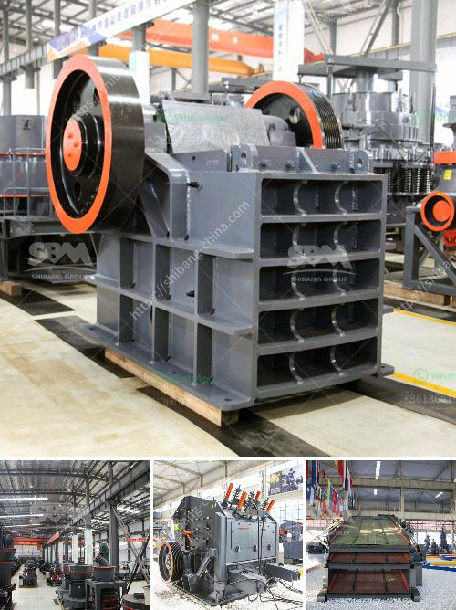

<h3>coal mining equipment coal mining equipment for sale</h3>
Coal mining is a significant industry in today's global economy. Most countries rely on coal as a major source of energy, and production has been increasing over the past few decades. As the demand for coal rises, so does the need for efficient and reliable coal mining equipment.

Coal mining equipment plays an essential role in the mining process. Coal mining equipment enables the extraction of coal from underground mines or the removal of overburden in open-pit mines. This equipment is specifically designed for the demanding environment in the coal mining industry.

One crucial piece of equipment in the coal mining industry is the blasthole drill. These drills are used to create holes in the rock or soil, so explosives can be inserted to break the material for easier removal. Blasthole drills come in various sizes, depending on the depth and width of the hole needed. These drills are equipped with advanced technology to ensure accuracy and efficiency.

Another essential piece of equipment in coal mining is the coal hauler. These large machines are used to transport coal from the mining site to the processing plant or storage area. Coal haulers come in different sizes and capacities, depending on the volume of coal that needs to be moved. These machines are designed to withstand rough terrains and carry heavy loads safely.

Continuous miners are also crucial in the coal mining process. These machines are used to extract coal from the face of the coal seam. Continuous miners have rotating cutting heads that are equipped with tungsten carbide teeth. As the machine moves along the coal seam, it cuts the coal, which is then loaded onto a conveyor belt for transport.

Safety in the coal mining industry is a top priority, and specialized equipment has been developed to ensure the well-being of workers. Roof bolters are one example of such equipment. These machines are used to secure the roof and prevent cave-ins. They drill holes into the rock formation and insert bolts to reinforce the roof, creating a safe working environment for miners.

Coal mining equipment is continually evolving to meet the demands of the industry. As technological advancements are made, more efficient and productive equipment is developed. Companies that offer coal mining equipment for sale are constantly working on improving their products to increase safety and productivity.

There are various avenues to purchase coal mining equipment, including buying new or used equipment or leasing equipment for shorter durations. It is crucial to consider the specific requirements of each mining operation to choose the most suitable equipment.

In conclusion, coal mining equipment is critical to the success of the coal mining industry. High-quality and reliable equipment increases productivity and ensures the safety of workers. With the rising demand for coal worldwide, the need for advanced coal mining equipment is set to grow. As technology continues to advance, new and more efficient equipment will help meet the demands of the industry.
<h3>Contact us</h3><ul><li><strong>Whatsapp:&nbsp;<a href="https://wa.me/8613661969651">+8613661969651</a></strong></li><li><a href="https://swt.shibang-china.com/?git&amp;zhl&amp;coal mining equipment coal mining equipment for sale"><strong>Online Service(chat now)</strong></a></li></ul><h3>Related</h3><ul><li><a href='portable jaw crusher in saudi.md'>portable jaw crusher in saudi</a></li><li><a href='cement clinker grinding equipmenttpd.md'>cement clinker grinding equipmenttpd</a></li><li><a href='gold plant for sale south africa.md'>gold plant for sale south africa</a></li><li><a href='coal manufacturers pulverizers.md'>coal manufacturers pulverizers</a></li><li><a href='gold mining compressor price in south africa.md'>gold mining compressor price in south africa</a></li></ul>