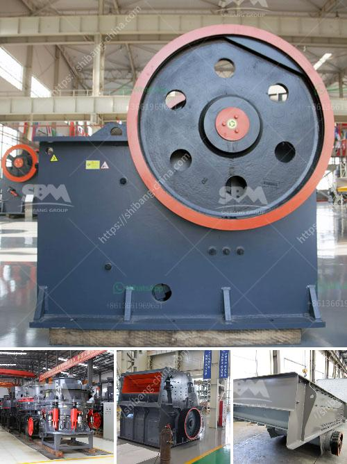

<h3>coal mining equipment for sale in germany</h3>
Germany has a long history of coal mining, going back centuries. The first coal mines in the country were established in the 12th century, and the mining industry has been thriving ever since. Germany is currently the fourth largest producer of coal worldwide, behind China, the United States, and India. Despite the country's efforts to transition to cleaner energy sources, coal still plays a significant role in Germany's energy mix.

One of the key factors contributing to Germany's success in coal mining is its advanced mining equipment. With a focus on efficiency, safety, and sustainability, German manufacturers have long been recognized as leaders in the coal mining industry. Many mining equipment suppliers from Germany have forged partnerships with local companies to provide state-of-the-art mining equipment to improve productivity and ensure the safety of miners.

Coal mining equipment for sale in Germany is categorized into several types. Some of the common equipment used in mining include excavators, draglines, bulldozers, loaders, and roadheaders. These types of heavy equipment are essential for efficient and effective coal mining operations. 

Excavators are one of the most commonly used tools in coal mining. These machines are equipped with buckets that can lift and remove tons of earth and coal, making excavation faster and more efficient. They are also equipped with advanced technologies to ensure precision and accuracy.

Draglines, on the other hand, are used for large-scale open-pit mining operations. These massive machines are capable of removing overburden and exposing coal seams. Draglines can work on a large scale, removing massive amounts of soil and rock in a single pass. With their huge buckets and long booms, they can extract coal from depths that other equipment cannot reach.

Bulldozers and loaders are used to transport coal from the mining site to the nearby processing plant or storage areas. These machines are equipped with large blades or buckets that can push or carry coal efficiently. They are designed to handle heavy loads and operate in uneven terrains, making them essential in coal mining operations.

Roadheaders are another type of equipment commonly used in coal mining. These machines are designed to excavate tunnels in coal mines or to create access to underground mines. Roadheaders are equipped with cutting heads that can grind through rock and coal, creating tunnels of various dimensions.

Germany offers a wide range of coal mining equipment for sale, catering to different needs and budgets. Companies looking to invest in Germany's coal mining industry can find reliable and high-quality equipment from various manufacturers. These equipment suppliers also provide maintenance and after-sales services to ensure the smooth operation of the mining equipment.

In conclusion, Germany's coal mining industry relies on advanced and efficient equipment to ensure its continued success. The country's long-standing expertise in mining equipment manufacturing has made it a leader in the industry. With a variety of coal mining equipment available for sale, companies can find the equipment they need to meet their specific mining requirements.
<h3>Contact us</h3><ul><li><strong>Whatsapp:&nbsp;<a href="https://wa.me/8613661969651">+8613661969651</a></strong></li><li><a href="https://swt.shibang-china.com/?git&amp;zhl&amp;coal mining equipment for sale in germany"><strong>Online Service(chat now)</strong></a></li></ul><h3>Related</h3><ul><li><a href='cement plant in india cement plant.md'>cement plant in india cement plant</a></li><li><a href='modular conveyor belt supplier china.md'>modular conveyor belt supplier china</a></li><li><a href='charcoal pulverizer machine philippines.md'>charcoal pulverizer machine philippines</a></li><li><a href='feasibility study on barite milling plants.md'>feasibility study on barite milling plants</a></li><li><a href='price of gold mining equipment.md'>price of gold mining equipment</a></li></ul>