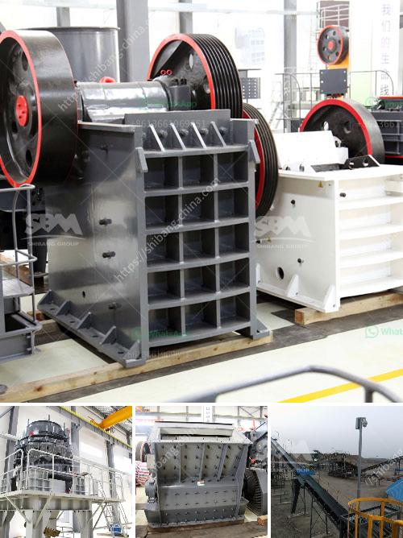

<h3>coal mining prices machines</h3>
Coal mining is an essential industry that provides energy and raw materials for various sectors, including power generation, steel production, and manufacturing. However, the process of extracting coal from underground mines involves complex machinery and comes at a significant cost.

The price of coal mining machines can vary greatly depending on several factors, including the size and capacity of the equipment, the technology used, and the durability and reliability it offers. Generally, prices for coal mining machines can range from tens of thousands to millions of dollars.

One of the most common machines used for coal mining is the continuous miner, which utilizes rotating drums equipped with teeth to scrape coal from the rock face. This machine is capable of drilling into and breaking apart dense rock formations to access coal seams. Continuous miners can vary significantly in price, depending on their size, power, and cutting capacity.

Another key machine in the coal mining industry is the longwall miner. This giant machine is designed to cut into coal seams and remove the extracted coal smoothly and efficiently. Longwall miners are more expensive compared to continuous miners, but they offer higher productivity and require fewer personnel to operate.

Furthermore, prices for coal mining machines also depend on the quality and reliability of the brand. Established manufacturers with a strong track record of performance and durability may command higher prices for their equipment.

Aside from the initial purchase cost, coal mining machines also require maintenance, repairs, and replacement parts, which further contribute to the overall expense. Ensuring the proper upkeep of these machines is crucial to maximize their lifespan and productivity.

The coal mining industry heavily relies on the efficiency and effectiveness of its machinery to ensure productivity and profitability. However, high-quality equipment comes with a higher price tag. It is crucial for mining companies to carefully consider the cost-benefit ratio of investing in these machines, as well as the long-term benefits they can provide in terms of increased output and reduced downtime.

In conclusion, coal mining machines play a crucial role in the industry, enabling the extraction of coal for various sectors. However, the prices of these machines can vary significantly based on factors such as capacity, technology, and durability. Mining companies must carefully evaluate the cost-benefit ratio and consider long-term benefits when investing in coal mining equipment.
<h3>Contact us</h3><ul><li><strong>Whatsapp:&nbsp;<a href="https://wa.me/8613661969651">+8613661969651</a></strong></li><li><a href="https://swt.shibang-china.com/?git&amp;zhl&amp;coal mining prices machines"><strong>Online Service(chat now)</strong></a></li></ul><h3>Related</h3><ul><li><a href='stone crusher for gravel.md'>stone crusher for gravel</a></li><li><a href='conveyor belt structure design.md'>conveyor belt structure design</a></li><li><a href='ball mill suppliers in hyderabad.md'>ball mill suppliers in hyderabad</a></li><li><a href='kaolin clay processing machinery.md'>kaolin clay processing machinery</a></li><li><a href='recycling machines stone production.md'>recycling machines stone production</a></li></ul>