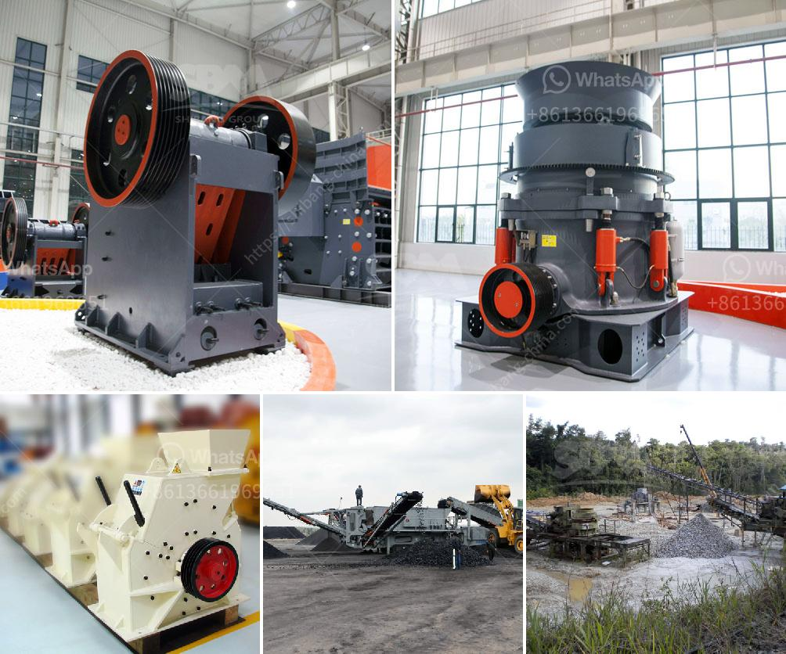

<h3>coal powder making machine</h3>
Coal powder making machine is a device used to grind coal into a fine powder, which can be used for various industrial purposes. It is an essential equipment for efficient and environmentally friendly coal utilization.

Coal powder making machines are widely used in thermal power plants, metallurgy, chemicals, building materials, and other industries. The size of the material processed by coal powder making machine is small, uniform particle size, and convenient for combustion and utilization. The machine has the characteristics of simple structure, high production efficiency, and easy operation.

The coal powder making machine consists of a feeding device, a main bearing rotating part, a transmission device, a discharging device, a high-pressure start-up device, and a lubricating system. The feeding device continuously and uniformly feeds the coal into the grinding chamber of the machine, and the rotating part drives the grinding roller and grinding ring to rotate during operation, so as to achieve the purpose of crushing and grinding coal. The ground coal powder is discharged from the discharge port through the wind guiding device, and the finished product is collected by a dust collector.

The main bearing of the coal powder making machine is a key component that supports the entire rotating part and transmits the force during operation. Therefore, it is required to have high carrying capacity, good lubrication, and small friction coefficient. Otherwise, it will cause abnormal operation and affect the efficiency of coal powder making machine.

In order to ensure the reliable operation of the coal powder making machine, regular inspection and maintenance are necessary. Firstly, the lubricating oil should be replaced regularly to ensure the smoothness and cleanliness of the lubricating system. Secondly, the wearing parts such as grinding rolls and grinding rings should be checked regularly, and if necessary, they should be replaced in time to avoid affecting the normal operation of the machine.

Coal powder making machines are constantly improving in technology and performance. With the development of society and the increase in demand for energy, the utilization of coal has become an important issue for sustainable development. The coal powder making machine provides a reliable and efficient solution for coal processing, making it an indispensable equipment in the coal utilization industry.

In conclusion, the coal powder making machine is essential equipment for the efficient and environmentally friendly utilization of coal. It has the advantages of simple structure, high efficiency, and easy operation. Regular maintenance and inspection can ensure its reliable operation. With the continuous improvement of technology, the coal powder making machine will play a more important role in promoting the sustainable development of the coal utilization industry.
<h3>Contact us</h3><ul><li><strong>Whatsapp:&nbsp;<a href="https://wa.me/8613661969651">+8613661969651</a></strong></li><li><a href="https://swt.shibang-china.com/?git&amp;zhl&amp;coal powder making machine"><strong>Online Service(chat now)</strong></a></li></ul><h3>Related</h3><ul><li><a href='tons per hour cement grinding plant.md'>tons per hour cement grinding plant</a></li><li><a href='different type of grinding mills.md'>different type of grinding mills</a></li><li><a href='size of ball mill with cspacity 280 tph.md'>size of ball mill with cspacity 280 tph</a></li><li><a href='gold mining compressor price in south africa.md'>gold mining compressor price in south africa</a></li><li><a href='crusher mill sales in malaysia.md'>crusher mill sales in malaysia</a></li></ul>