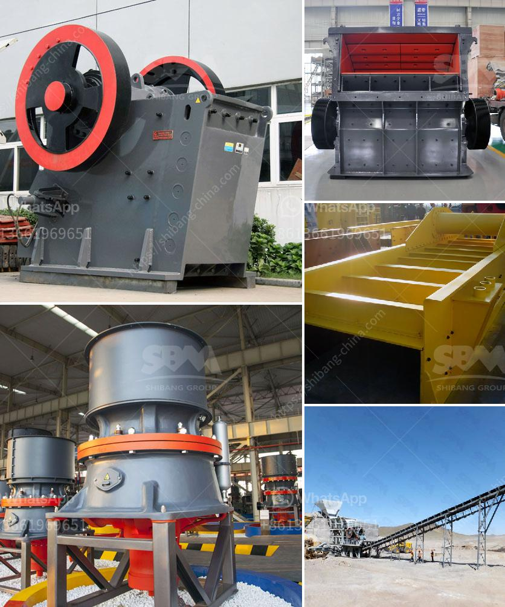

<h3>coal processing plant crusher</h3>
Coal processing plants are important to the overall processing and production of coal, which plays an important role in energy production and ensures the efficiency of coal utilization. Therefore, coal processing plants must be designed and operated to handle and process the coal efficiently. In this article, we will discuss the importance of a coal processing plant crusher in the coal industry.

The coal industry relies heavily on crushers to pulverize coal for combustion in various types of power plants. These crushers have different requirements and are used in different applications. Some coal processing plants will require more than one crusher to meet the production requirements.

Once the raw coal is extracted from the ground, it is carried to the stockpile area for further processing. In order to process the coal, a series of crushers is required. The crushing size can be adjusted to the requirements of the customer. For example, the crushing size of coal for a power plant might be less than 3mm.

To meet the requirements, the coal is firstly crushed to a fine particle size by a series of coal crushers. This equipment reduces the coal particle size from several inches to the required 0-3mm size. After crushing, the coal is conveyed to a transfer station where it is sampled by automatic samplers. This ensures that the quality of the coal meets the specifications required for the particular power plant.

The next step in the coal processing plant is to screen the coal into various sizes. This is achieved using a series of vibrating screens. The larger sizes of coal are retained on the screens for further processing, while the smaller sizes are sent to a cyclone for dense media separation. This process helps to remove impurities and create a more efficient combustion process.

Once the coal has been processed and screened, it is then transported to storage areas or directly to the power plant for combustion. The coal processing plant crusher can be equipped with different types of crushers and auxiliary equipment to meet the requirements of different crushing conditions and different types of coal.

Then the processing and distribution of coal is carried out, and the coal handling process at the coal processing plant needs to be monitored, controlled and optimized. The coal processed by the crusher is then screened and transported to the weighing station where the coal is weighed and distributed to various customers. The crushers are an integral part of the coal processing plant, and help improve coal processing efficiency and precision.

Coal processing plants are an integral part of the coal industry in providing clean coal for power plants. Their role in coal processing, as well as downstream industries, cannot be underestimated. The importance of a coal processing plant crusher cannot be overstated, and its role in the coal industry is crucial for productivity and efficiency.
<h3>Contact us</h3><ul><li><strong>Whatsapp:&nbsp;<a href="https://wa.me/8613661969651">+8613661969651</a></strong></li><li><a href="https://swt.shibang-china.com/?git&amp;zhl&amp;coal processing plant crusher"><strong>Online Service(chat now)</strong></a></li></ul><h3>Related</h3><ul><li><a href='silica quartz grinding plants bangalore.md'>silica quartz grinding plants bangalore</a></li><li><a href='high energy ball mill.md'>high energy ball mill</a></li><li><a href='mobile crusher plant for hire in province.md'>mobile crusher plant for hire in province</a></li><li><a href='mobile crusher japan.md'>mobile crusher japan</a></li><li><a href='quartz powder machine.md'>quartz powder machine</a></li></ul>