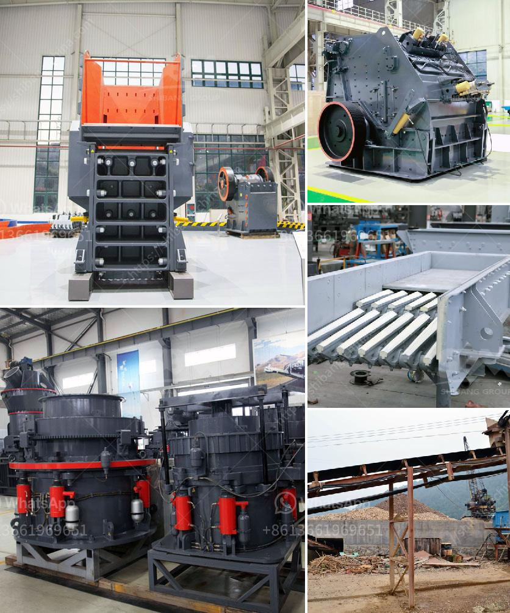

<h3>coal processing plant maintenance</h3>
Coal is one of the most important sources of energy worldwide and the backbone of many industries. Whether it is used for electricity generation, heating, or the production of steel and cement, coal plays a significant role in meeting the energy demands of modern society. To ensure the uninterrupted supply of coal, it is crucial to have efficient and well-maintained coal processing plants.

Coal processing plants are responsible for sorting, washing, and preparing coal to be used in various industrial processes. These plants typically consist of several components, including crushers, screens, washers, and conveyors, all working together to process coal and remove impurities.

Maintenance plays a pivotal role in ensuring the smooth operation and optimal performance of coal processing plants. Regular inspection, repair, and servicing of equipment are essential to prevent unexpected breakdowns, reduce downtime, and optimize overall plant efficiency. Here are some key aspects of coal processing plant maintenance.

Firstly, a comprehensive monitoring system should be in place to keep track of vital parameters such as temperature, vibration, and pressure. This data can help identify potential issues before they escalate into larger problems. Regular inspections should be conducted to check for signs of wear and tear, and any damaged or worn-out parts should be replaced promptly to avoid costly breakdowns.

Secondly, proper lubrication is crucial to the longevity and smooth operation of processing plant equipment. Components such as crushers and conveyors rely on lubricants to reduce friction, minimize wear, and prevent overheating. Regular lubrication checks and scheduled oil changes are necessary to ensure the effective functioning of these machines.

Furthermore, regular cleaning and washing of equipment are necessary to maintain plant efficiency. Over time, coal processing plants accumulate dirt, dust, and other contaminants, which can hinder the proper functioning of equipment. Thorough cleaning of screens, filters, and other components can improve plant performance and prevent blockages.

In addition to these routine maintenance tasks, it is important to have a well-trained and competent maintenance team. These professionals should have a solid understanding of the equipment and processes involved in coal processing plants. They should also stay updated with the latest maintenance techniques and technologies to ensure effective and efficient plant maintenance. Regular training sessions and knowledge-sharing initiatives should be conducted to enhance the skills of the maintenance team.

Advancements in technology have enabled the use of remote monitoring and predictive maintenance tools in coal processing plants. These tools can gather real-time data, analyze it, and provide predictive insights into potential failures or maintenance needs. By adopting such technologies, plant operators can proactively address maintenance issues, optimize equipment performance, and reduce downtime.

In conclusion, maintenance plays a crucial role in the efficient and uninterrupted operation of coal processing plants. Regular inspections, repairs, proper lubrication, and cleaning are essential to prevent breakdowns, optimize equipment performance, and reduce downtime. Furthermore, having a competent maintenance team and leveraging advanced technologies can further enhance plant maintenance efforts. With a well-maintained coal processing plant, the production and supply of coal can be ensured, meeting the energy demands of industries worldwide.
<h3>Contact us</h3><ul><li><strong>Whatsapp:&nbsp;<a href="https://wa.me/8613661969651">+8613661969651</a></strong></li><li><a href="https://swt.shibang-china.com/?git&amp;zhl&amp;coal processing plant maintenance"><strong>Online Service(chat now)</strong></a></li></ul><h3>Related</h3><ul><li><a href='slag crushing machine.md'>slag crushing machine</a></li><li><a href='south africa used chrome ore mining crushing equipment.md'>south africa used chrome ore mining crushing equipment</a></li><li><a href='used rock crusher dealers in usa.md'>used rock crusher dealers in usa</a></li><li><a href='manufacturing processes of clay products.md'>manufacturing processes of clay products</a></li><li><a href='sandstone crusher quarry.md'>sandstone crusher quarry</a></li></ul>