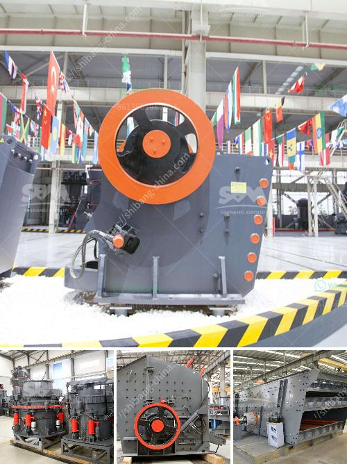

<h3>coal pulverizer machine price</h3>
Coal is one of the most significant sources of energy worldwide, and it plays a crucial role in generating electricity for industrial and residential use. To ensure that coal is efficiently used for energy production, it must undergo pulverization, a process that transforms the coal into a fine powder. This finely ground coal is then utilized as fuel in power plants and other industries.

Coal pulverizer machines are essential equipment in the pulverization process. These machines crush coal into a fine powder, using high-speed rotating blades. These blades ensure a consistent and efficient particle size reduction, which allows for a more efficient combustion process. As a result, the energy output from utilizing pulverized coal is enhanced, maximizing its potential as a fuel source.

One of the key considerations when determining the price of coal pulverizer machines is the power output capacity. It contributes to the efficiency of the pulverization process, which translates to the amount of coal needed per unit of energy produced. Higher power output capabilities generally incur higher costs, as these machines require robust construction and larger components.

Another crucial factor affecting the price of coal pulverizer machines is the material used in their construction. High-quality materials ensure the durability and longevity of the machines, thereby reducing maintenance and replacement costs. Additionally, the precision engineering of these machines allows for higher productivity and efficiency, which can justify a higher price.

The manufacturer or brand of the coal pulverizer machine also impacts the price. Renowned brands often come with a higher price tag due to their reputation for producing reliable and highly efficient equipment. These established manufacturers typically invest in research and development to continuously improve their products, resulting in better performance and quality.

The price of coal pulverizer machines typically ranges from $5,000 to $20,000. The specifics will vary depending on the manufacturer, capacity, and materials used in its construction. It is essential to choose a coal pulverizer machine that suits your specific requirements while ensuring a balance between price and performance.

In conclusion, the coal pulverizer machine price is influenced by various factors such as power output capacity, materials used, and the manufacturer. Investing in a high-quality coal pulverizer machine allows for efficient coal utilization, maximizing its potential as a reliable and cost-effective fuel source in power plants and other industrial applications.
<h3>Contact us</h3><ul><li><strong>Whatsapp:&nbsp;<a href="https://wa.me/8613661969651">+8613661969651</a></strong></li><li><a href="https://swt.shibang-china.com/?git&amp;zhl&amp;coal pulverizer machine price"><strong>Online Service(chat now)</strong></a></li></ul><h3>Related</h3><ul><li><a href='gold plant for sale south africa.md'>gold plant for sale south africa</a></li><li><a href='crushers and grinders mill.md'>crushers and grinders mill</a></li><li><a href='sale ghana grinding crusher.md'>sale ghana grinding crusher</a></li><li><a href='complete gravel production line.md'>complete gravel production line</a></li><li><a href='3 roller raymond mill delhi.md'>3 roller raymond mill delhi</a></li></ul>