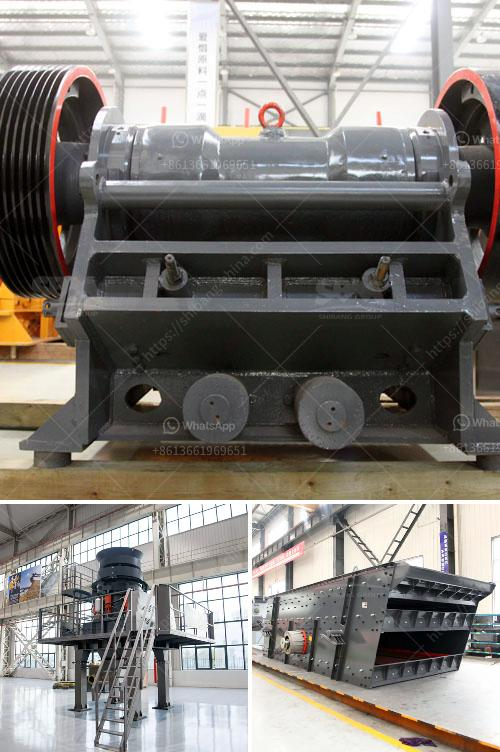

<h3>coal screening plant in morbi</h3>
The coal screening plant in Morbi is a crucial component for the coal industry in the region. Located in the industrial hub of Gujarat, this plant effectively separates impurities from raw coal to ensure clean and efficient transportation. With a capacity to process approximately [insert capacity] of coal per hour, it plays a pivotal role in streamlining the coal supply chain.

The screening process involves the use of state-of-the-art equipment, including vibrating screens and crushers, to separate the desired coal size from oversized rocks, stones, and other impurities. This helps in maintaining the quality and consistency of the coal product, which is essential for various industries that rely on coal as a primary source of energy.

One of the primary advantages of the coal screening plant in Morbi is its strategic location. Gujarat is known for its coal-rich regions, and Morbi serves as a major transportation hub for coal, with well-connected roads and railway networks. This proximity to the source enables efficient sourcing, processing, and distribution of coal throughout the state and beyond.

Moreover, the plant adheres to strict environmental and safety standards, ensuring that the screening process does not pose any harm to the environment or the workers. Dust control measures are implemented to minimize air pollution, and regular maintenance and safety checks are conducted to prevent any accidents.

The coal screening plant in Morbi has significant implications for the region's economy as well. Apart from providing employment opportunities to local residents, it also boosts the overall industrial growth and contributes to the state's revenue. The availability of clean and screened coal enhances the efficiency of various industries, such as power plants, cement factories, and steel mills, indirectly aiding in economic development and job creation.

In conclusion, the coal screening plant in Morbi is a vital infrastructure component for the coal industry in Gujarat. Through its efficient and environmentally-friendly processes, it ensures the availability of high-quality coal for various sectors. Its strategic location and adherence to safety measures further contribute to the overall development of the region.
<h3>Contact us</h3><ul><li><strong>Whatsapp:&nbsp;<a href="https://wa.me/8613661969651">+8613661969651</a></strong></li><li><a href="https://swt.shibang-china.com/?git&amp;zhl&amp;coal screening plant in morbi"><strong>Online Service(chat now)</strong></a></li></ul><h3>Related</h3><ul><li><a href='coal mining equipment for sale in germany.md'>coal mining equipment for sale in germany</a></li><li><a href='ball mill sale in cali.md'>ball mill sale in cali</a></li><li><a href='coal processing plant maintenance.md'>coal processing plant maintenance</a></li><li><a href='how to calculate cost per ton crusher aggregate.md'>how to calculate cost per ton crusher aggregate</a></li><li><a href='cone crusher suppliers.md'>cone crusher suppliers</a></li></ul>