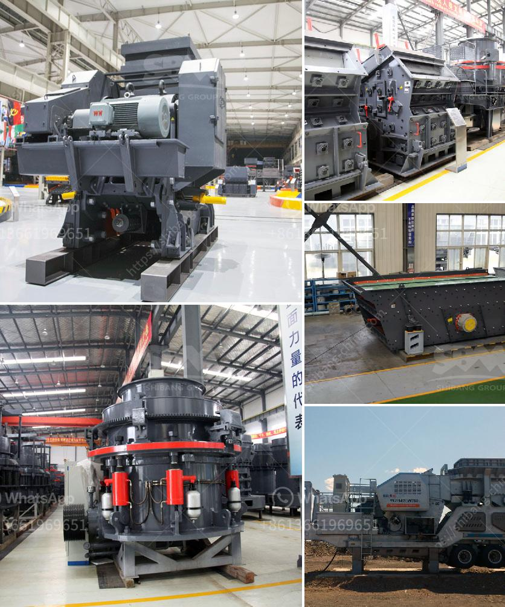

<h3>coal specifications for power plant</h3>
Coal has been a primary source of energy for power generation for centuries. However, with increasing environmental concerns and stricter regulations, it has become imperative for power plants to carefully consider the coal specifications they use. In this article, we will delve into the key coal specifications that power plants need to be aware of.

1. Calorific Value: The calorific value of coal refers to the amount of heat energy released when the coal is burned. It is typically measured in British Thermal Units (BTUs) per pound or megajoules per kilogram. Power plants often prefer coal with a higher calorific value as it translates to higher energy output.

2. Moisture Content: The moisture content in coal directly impacts its heating capabilities. Wet or moist coal not only has a lower calorific value but also requires more energy to evaporate the excess moisture. Power plants usually aim for coal with a moisture content of 5-10% to ensure efficient combustion and avoid any operational issues caused by excessive moisture.

3. Ash Content: Ash content refers to the incombustible mineral residue left after coal combustion. Power plants prefer coal with lower ash content as high ash content can lead to operational problems, such as increased erosion of furnace equipment and increased emissions. High-quality coals typically have ash content below 10%.

4. Sulfur Content: The sulfur content in coal is a crucial specification, especially in the context of environmental considerations. High sulfur content leads to the release of sulfur dioxide (SO2) during combustion, causing air pollution. Therefore, power plants must aim for low sulfur coals or adopt mitigation technologies, such as flue gas desulfurization, to reduce SO2 emissions.

5. Volatile Matter: The volatile matter in coal refers to the combustible gases released during the initial stages of combustion before the formation of a solid char residue. It indicates the coal's potential to ignite and burn efficiently. Higher volatile matter content allows for better combustion and improved energy generation.

6. Size and Grindability: Coal size and grindability play a crucial role in power plant operations. Different power generation technologies require different coal sizes and grindability parameters. Smaller coal sizes are generally preferred for better combustion efficiency. Additionally, grindability, measured by the Hardgrove Grindability Index (HGI), determines the ease and efficiency of grinding coal for pulverized coal-fired power plants.

7. Carbon Content: The carbon content in coal affects its combustion and, consequently, the amount of CO2 emissions generated. High carbon content translates to better combustion efficiency and lower CO2 emissions. Power plants typically seek coals with high carbon content to reduce their carbon footprint.

Power plants must carefully analyze these coal specifications to ensure their operations are efficient, environmentally compliant, and economically viable. While it is essential to consider these specifications, power plants should also conduct thorough testing and analysis of coal samples to guarantee consistent quality and performance.

In conclusion, coal specifications play a vital role in power plant operations. A careful assessment of coal's calorific value, moisture content, ash content, sulfur content, volatile matter, size, grindability, and carbon content allows power plants to make informed decisions and optimize their energy generation processes. By choosing the right coal and incorporating appropriate mitigation technologies, power plants can meet environmental regulations, improve efficiency, and reduce emissions.
<h3>Contact us</h3><ul><li><strong>Whatsapp:&nbsp;<a href="https://wa.me/8613661969651">+8613661969651</a></strong></li><li><a href="https://swt.shibang-china.com/?git&amp;zhl&amp;coal specifications for power plant"><strong>Online Service(chat now)</strong></a></li></ul><h3>Related</h3><ul><li><a href='200tph mobile crusher prices used.md'>200tph mobile crusher prices used</a></li><li><a href='single stage hammer crusher hot sale.md'>single stage hammer crusher hot sale</a></li><li><a href='stone crusher in cebu.md'>stone crusher in cebu</a></li><li><a href='chrome wash plant operational diagram.md'>chrome wash plant operational diagram</a></li><li><a href='coal mining equipment coal mining equipment for sale.md'>coal mining equipment coal mining equipment for sale</a></li></ul>