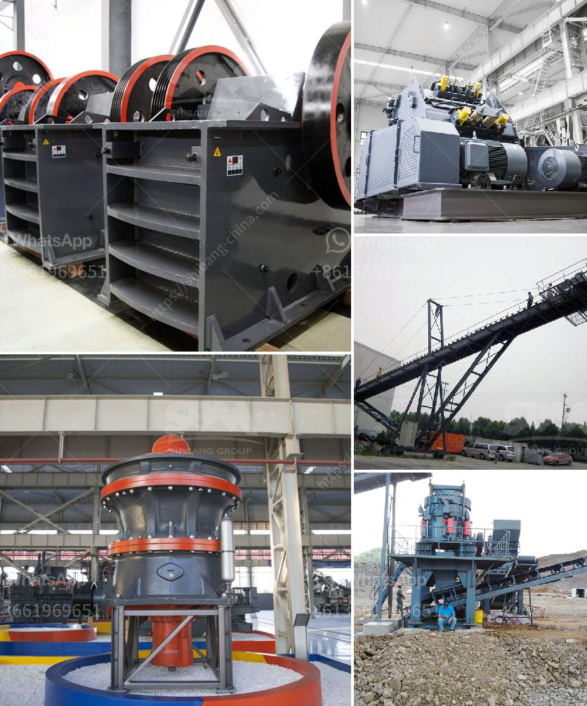

<h3>coal transfer conveyor supplier in china</h3>
Coal mining is a significant industry in China. It is one of the largest consumers and producers of coal globally. Coal is China's primary source of energy and a vital component for its industrial development. With the increasing demand for coal, efficient systems for coal handling and transportation are crucial. This is where coal transfer conveyor suppliers play a significant role.

China has a vast network of coal mines scattered across the country. Coal needs to be extracted from mines, processed, and transported to power plants and industrial facilities. The traditional method of manual labor for coal handling is not practical for large-scale operations. Therefore, modern technologies, such as conveyor systems, have become essential for effective coal transfer.

Conveyor systems are mechanical handling equipment designed to move bulk materials, including coal, from one location to another. These systems consist of belts, pulleys, rollers, and motors, which work together to transport coal efficiently and minimize the risk of spillage or damage. Coal transfer conveyor suppliers in China specialize in designing, manufacturing, and installing conveyor systems for coal mines and power plants.

One prominent supplier in China is Zhenying Conveying Equipment Co., Ltd. Established in 1998, Zhenying Conveying Equipment has gained a reputation for providing high-quality conveyor systems for various industries, including coal mining. Their coal transfer conveyors are designed to handle the demanding conditions of coal mines while ensuring smooth and reliable operation.

Zhenying Conveying Equipment offers a range of conveyor systems tailored to specific customer requirements. Their conveyor belts are constructed with durable materials to withstand harsh environments and heavy loads associated with coal handling. These belts are equipped with efficient cleaning systems to prevent material buildup and ensure the continuous flow of coal.

In addition to conveyor belts, Zhenying Conveying Equipment also provides a wide range of accessories and components, such as pulleys, idlers, and rollers. These components are carefully designed to enhance the performance and longevity of conveyor systems, reducing maintenance costs and downtime.

Furthermore, Zhenying Conveying Equipment focuses on the safety aspects of coal transfer conveyor systems. Their designs incorporate safety features such as emergency stop switches, safety guards, and protective covers. Regular maintenance and inspections are also conducted to ensure the safe operation of their conveyor systems.

As environmental concerns continue to grow, coal transfer conveyor suppliers in China are also developing innovative solutions for reducing energy consumption and minimizing carbon emissions. Zhenying Conveying Equipment, for example, offers energy-efficient motors and optimized conveyor designs to promote sustainability in coal handling operations.

In conclusion, coal transfer conveyor suppliers in China play a vital role in the efficient and safe transportation of coal. With their expertise and innovative solutions, they contribute to the growth of China's coal mining industry while addressing environmental challenges. As the demand for coal continues to rise, it is essential to rely on reliable and reputable suppliers to ensure the smooth and sustainable operation of conveyor systems.
<h3>Contact us</h3><ul><li><strong>Whatsapp:&nbsp;<a href="https://wa.me/8613661969651">+8613661969651</a></strong></li><li><a href="https://swt.shibang-china.com/?git&amp;zhl&amp;coal transfer conveyor supplier in china"><strong>Online Service(chat now)</strong></a></li></ul><h3>Related</h3><ul><li><a href='copper processing plants in usa for sale.md'>copper processing plants in usa for sale</a></li><li><a href='cost of cement manufacturing plant.md'>cost of cement manufacturing plant</a></li><li><a href='pharma grade kaolin process.md'>pharma grade kaolin process</a></li><li><a href='to calculate cost of limestone production in mining.md'>to calculate cost of limestone production in mining</a></li><li><a href='cement manufacturing plant.md'>cement manufacturing plant</a></li></ul>