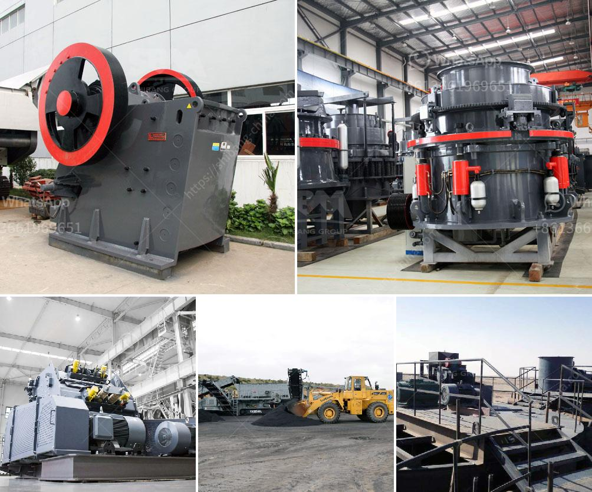

<h3>coal vibration equipment size</h3>
The coal industry is a significant player in the global energy sector, providing a reliable and affordable source of power for various industries worldwide. However, the extraction and transport processes of coal can present numerous challenges, one of which is the issue of vibration. Coal vibration equipment is necessary to effectively handle the various sizes of coal particles and minimize the detrimental effects caused by excessive vibrations.

Coal, as a natural resource, undergoes several processes before it can be used as fuel. To ensure its usability and quality, coal is often crushed and sorted into different sizes. The size of coal particles can vary significantly, ranging from fine dust to large chunks. This variability poses challenges in handling the coal efficiently, as different sizes require different approaches.

Vibration equipment is essential in coal handling systems to effectively manage the coal size variations. These equipment help in ensuring a consistent flow and prevent the occurrence of blockages or jams in the system, which can lead to significant downtime and operational inefficiencies.

One important factor in choosing the appropriate size of coal vibration equipment is the particle size distribution of the coal being handled. Fine coal particles tend to be more prone to inconsistencies and can easily form clumps. To address this, finer coal particles might require smaller equipment that can handle the delicate nature of these particles without causing excessive vibrations.

On the other hand, larger coal particles can create challenges due to their weight and size. They can cause more significant vibrations, potentially leading to equipment damage and increased maintenance requirements. To handle larger coal particles effectively, heavier and more robust vibration equipment is necessary to ensure stable operations.

The size of the coal vibration equipment also depends on the specific application within the coal handling system. For example, if the equipment is used in a coal washing process, it needs to handle a wide range of particle sizes, including both fine and coarse coal. In such cases, a versatile vibration equipment with adjustable settings may be required to accommodate the varying coal sizes.

Additionally, the throughput capacity of the coal handling system plays a crucial role in determining the size of the vibration equipment. A high-capacity coal handling system will require larger equipment to handle the increased volume of coal passing through the system. Conversely, a lower-capacity system may require smaller equipment to achieve optimal performance.

In conclusion, coal vibration equipment size is a critical consideration in ensuring efficient and reliable coal handling operations. Various factors such as the particle size distribution, application, and throughput capacity of the coal handling system influence the choice of equipment size. Selecting the appropriate size of coal vibration equipment is essential to minimize vibrations, prevent blockages, and ensure a consistent and reliable flow of coal throughout the handling system. By investing in the right size equipment, coal operators can enhance operational efficiency, reduce downtime, and ultimately maximize the profitability of their operations.
<h3>Contact us</h3><ul><li><strong>Whatsapp:&nbsp;<a href="https://wa.me/8613661969651">+8613661969651</a></strong></li><li><a href="https://swt.shibang-china.com/?git&amp;zhl&amp;coal vibration equipment size"><strong>Online Service(chat now)</strong></a></li></ul><h3>Related</h3><ul><li><a href='specification of jaw crusher.md'>specification of jaw crusher</a></li><li><a href='jaw crusher with protection.md'>jaw crusher with protection</a></li><li><a href='crusher plant business requirement in paistan.md'>crusher plant business requirement in paistan</a></li><li><a href='usina de minerio de ferro para venda no mexico.md'>usina de minerio de ferro para venda no mexico</a></li><li><a href='jaw crusher for sale uk.md'>jaw crusher for sale uk</a></li></ul>