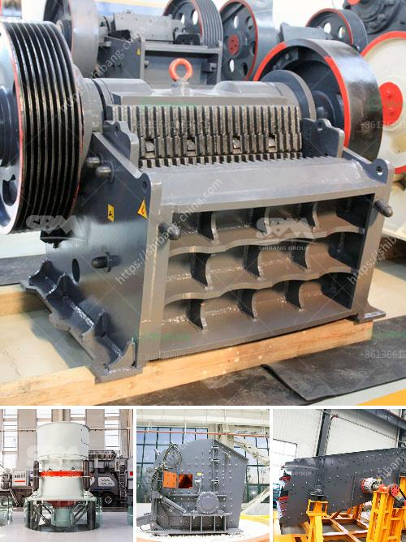

<h3>coal wash and crusher machine</h3>
Coal washing is a process that is undertaken in a coal washery or coal preparation plant (CPP) where coal is refined or cleaned of impurities. Coal washing involves using water, mechanical techniques, and chemicals to remove impurities such as sulfur, ash, and rock dust from coal, thereby improving its quality and allowing it to be burned more efficiently.

One of the key components in this process is the crusher machine. Crushing is often performed on bulk material samples to make its size smaller and more manageable. Crushers are capable of reducing the size of large chunks of coal into smaller lumps, which can then be processed further in the washery plant.

The crusher machine used for coal crushing operations is ruggedly constructed and features a massive rotor with large rotating hammers and wear-resistant plates. These machines can handle even the toughest materials, such as coal, and are capable of reducing their size to the desired level.

The coal crusher machine is designed in such a way that it can handle both large-scale and small-scale coal crushing operations. Furthermore, the crusher machine is easy to operate and convenient to maintain. It also has a wide range of applications, making it suitable for various industries that require coal crushing.

In the coal washery plant, the crusher machine plays a crucial role in breaking down the coal into smaller pieces for further processing. It is also responsible for ensuring that impurities are removed from the coal prior to combustion. The crushed coal is then sent to a coal washing system, where it is mixed with water and other chemicals to remove impurities and further refine the coal.

Overall, coal washing and crusher machines are essential components in the coal preparation process. They enable efficient coal utilization by removing impurities and reducing the size of bulk coal samples. By doing so, these machines ensure that coal-fired power plants can generate electricity more efficiently and with minimal environmental impact.
<h3>Contact us</h3><ul><li><strong>Whatsapp:&nbsp;<a href="https://wa.me/8613661969651">+8613661969651</a></strong></li><li><a href="https://swt.shibang-china.com/?git&amp;zhl&amp;coal wash and crusher machine"><strong>Online Service(chat now)</strong></a></li></ul><h3>Related</h3><ul><li><a href='silica sand crusher machine manufacturin.md'>silica sand crusher machine manufacturin</a></li><li><a href='cost of crushed concrete.md'>cost of crushed concrete</a></li><li><a href='river sand and stone mining at sabah.md'>river sand and stone mining at sabah</a></li><li><a href='roller crusher manufacturer.md'>roller crusher manufacturer</a></li><li><a href='fuller traylor nt gyratory crusher manual.md'>fuller traylor nt gyratory crusher manual</a></li></ul>