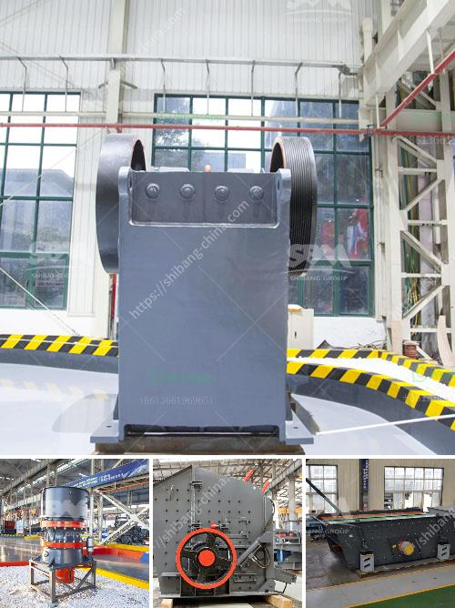

<h3>coal washing machines</h3>
Coal washing machines, also known as coal preparation plants, are used to remove impurities from raw coal before it is sold or used for energy production. Coal is one of the world's most abundant fossil fuels, and it plays a crucial role in generating electricity and powering industries. However, coal can contain various impurities, such as sulfur, which can cause environmental problems when burned. This is where coal washing machines come into play.

Coal washing machines are designed to separate and remove impurities from the coal by using different physical and chemical properties. The process of coal washing typically involves several stages.

In the first stage, the raw coal is crushed and graded into different sizes. This helps in separating coal particles based on their size and density. The crushed coal is then fed into a washing tank, where it is mixed with water and specific chemicals. The chemicals used in the washing process depend on the specific impurities present in the coal.

Next, the coal and water mixture is subjected to various physical separation techniques, such as gravity separation and flotation. Gravity separation relies on the difference in density between coal and impurities. This method uses water or air streams to separate coal particles from the heavier impurities. Flotation, on the other hand, uses the differences in surface properties between coal and impurities to selectively remove impurities.

Once the impurities are separated from the coal, the cleaned coal is dewatered and dried using centrifuges or mechanical filters. This reduces the moisture content of the coal and improves its quality for transportation and combustion.

There are various types of coal washing machines available, ranging from simple jigs to high-tech automated systems. Jigs are one of the oldest and simplest methods used for coal washing. They work by pulsating water through a bed of coal, which causes the heavier impurities to sink and the lighter coal to rise to the top. Jigs are cost-effective and widely used in small-scale coal washing operations.

More advanced coal washing machines utilize dense medium separation (DMS) technology. DMS involves suspending the coal in a dense medium, such as a suspension of fine magnetite particles in water. The coal particles with higher density sink, while the lighter impurities float. DMS technology is highly efficient in removing impurities from coal, but it requires extensive infrastructure and a large amount of magnetite.

Coal washing machines offer several benefits. Firstly, they improve the quality of coal by reducing its ash and sulfur content. This makes it more environmentally friendly and efficient for energy production. Secondly, coal washing machines help in maximizing the utilization of coal resources by extracting more energy from each ton of coal. Lastly, coal washing machines can reduce the environmental impact of burning coal by removing harmful impurities.

In conclusion, coal washing machines are essential in the coal industry to remove impurities and enhance the quality of coal used for energy production. They utilize various physical and chemical separation techniques to separate coal from impurities. Coal washing machines offer numerous benefits, including improved coal quality and reduced environmental impact. As the world continues to rely on coal for energy, the importance of coal washing machines in enhancing its efficiency and sustainability cannot be overstated.
<h3>Contact us</h3><ul><li><strong>Whatsapp:&nbsp;<a href="https://wa.me/8613661969651">+8613661969651</a></strong></li><li><a href="https://swt.shibang-china.com/?git&amp;zhl&amp;coal washing machines"><strong>Online Service(chat now)</strong></a></li></ul><h3>Related</h3><ul><li><a href='komatsu mobile impact crusher.md'>komatsu mobile impact crusher</a></li><li><a href='belt conveyor for coal design in india.md'>belt conveyor for coal design in india</a></li><li><a href='pakistan crusher machine.md'>pakistan crusher machine</a></li><li><a href='jaw crusher engine and complete set.md'>jaw crusher engine and complete set</a></li><li><a href='estimated cost of setting up a quarry.md'>estimated cost of setting up a quarry</a></li></ul>