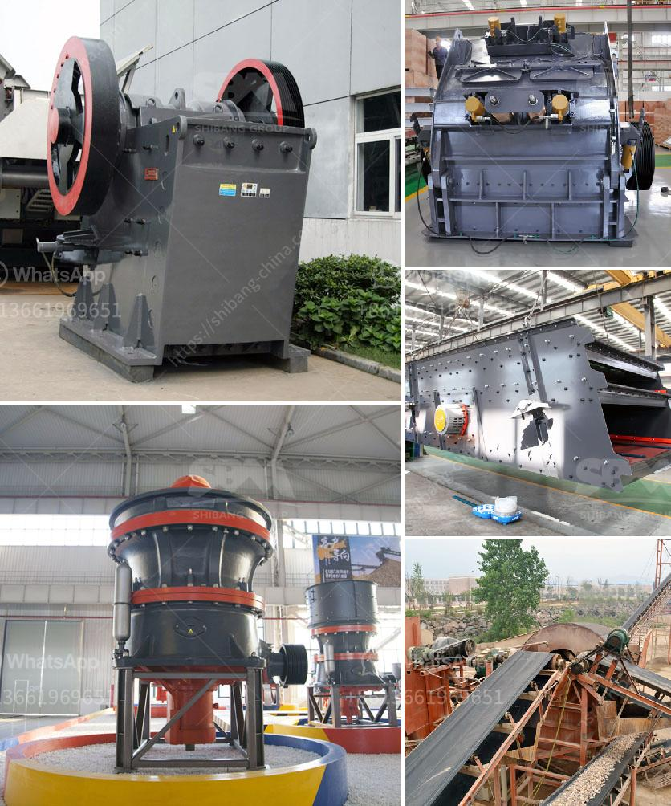

<h3>cobalt concentrate processing equiopment manufacturers</h3>
Cobalt, a crucial element for various industrial and technological applications, has witnessed a surge in global demand in recent years. From electric vehicles to aerospace and energy storage, cobalt plays a pivotal role in the development of advanced technologies. However, the extraction and processing of cobalt concentrate pose significant challenges, necessitating specialized equipment and machinery. In this article, we will discuss some of the leading manufacturers of cobalt concentrate processing equipment who are instrumental in meeting this growing global demand.

One of the prominent names in cobalt concentrate processing equipment manufacturing is Outotec. With over a century of experience, Outotec has established itself as a reliable and innovative provider of mineral processing and beneficiation solutions. Their comprehensive range of equipment encompasses everything from individual unit processes to complete plants. Outotec's technologies enable the efficient and sustainable processing of cobalt concentrates, ensuring high-quality end products for various downstream applications.

Another key player in this field is FEECO International, offering expertise in custom equipment design and manufacturing. FEECO specializes in engineering and fabricating custom rotary kilns, agglomeration drums, paddle mixers, and other processing equipment. Their team of experts works closely with clients to tailor solutions according to specific requirements. FEECO's equipment is renowned for its durability, reliability, and ability to handle the demanding conditions of cobalt concentrate processing.

Metso Outotec, formed by the merger of Metso and Outotec, is also a notable manufacturer in this domain. The company offers a wide range of equipment and services for cobalt processing, including crushers, screens, grinding mills, and filters. Metso Outotec's solutions ensure efficient particle size reduction and separation, as well as advanced automation and control systems for optimized operations. With their global presence and extensive research and development capabilities, Metso Outotec is well-positioned to serve the evolving needs of the cobalt industry.

In addition to these global leaders, there are several other manufacturers contributing to the cobalt concentrate processing equipment sector. These include Eriez Magnetics, a renowned supplier of magnetic separation technologies, and Multotec, specializing in mineral processing including dense medium separation. These companies bring diverse expertise and equipment options to the table, providing a competitive and dynamic landscape for cobalt concentrate processing solutions.

As the demand for cobalt continues to grow, manufacturers of processing equipment play a vital role in ensuring a reliable and sustainable supply chain. Their expertise in designing and manufacturing state-of-the-art equipment enables efficient and environmentally friendly processing of cobalt concentrates, minimizing waste generation and maximizing resource utilization. With ongoing innovation and advancements in technology, these manufacturers are poised to meet the evolving needs of the industry, contributing to the global transition towards a more sustainable and electrified future.

In conclusion, the demand for cobalt concentrate is on the rise, driven by the increasing use of advanced technologies in various industries. Cobalt concentrate processing equipment manufacturers such as Outotec, FEECO International, Metso Outotec, Eriez Magnetics, and Multotec play a crucial role in meeting this demand. Their expertise and high-quality equipment ensure efficient and sustainable processing, contributing to the development of a more technologically advanced and sustainable world.
<h3>Contact us</h3><ul><li><strong>Whatsapp:&nbsp;<a href="https://wa.me/8613661969651">+8613661969651</a></strong></li><li><a href="https://swt.shibang-china.com/?git&amp;zhl&amp;cobalt concentrate processing equiopment manufacturers"><strong>Online Service(chat now)</strong></a></li></ul><h3>Related</h3><ul><li><a href='cost of the project for 100 tph stone crushing unit.md'>cost of the project for 100 tph stone crushing unit</a></li><li><a href='hammer mill prices in zimbabwe.md'>hammer mill prices in zimbabwe</a></li><li><a href='mini rock crushers.md'>mini rock crushers</a></li><li><a href='project report of a tph stone crusher.md'>project report of a tph stone crusher</a></li><li><a href='stone crusher in the philippines for sale.md'>stone crusher in the philippines for sale</a></li></ul>