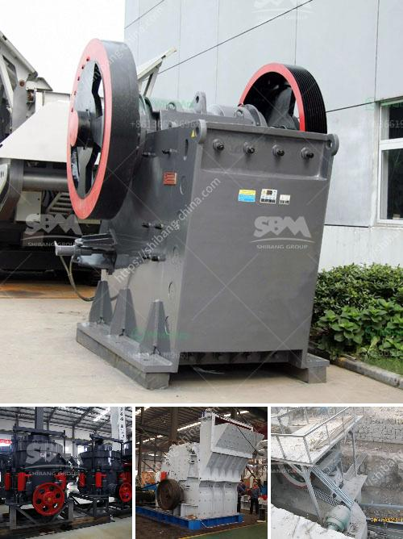

<h3>coconut shell crusher equipment</h3>
Coconut shells are discarded byproducts of the coconut agriculture industry. They are often considered as waste and disposed of, resulting in environmental pollution. However, coconut shells are highly beneficial and can be utilized in various industries if properly processed.

One solution to efficiently recycling coconut shells is the utilization of a coconut shell crusher equipment. This equipment is specially designed for crushing coconut shells into small pieces, eliminating the need for manual intervention. The resulting crushed material can be further processed into various applications, such as activated carbon, fuel pellets, and handicrafts.

With the increasing awareness of environmental protection and sustainable development, the demand for coconut shell crusher equipment has grown rapidly. This equipment not only effectively reduces waste but also creates value from the discarded coconut shells.

The coconut shell crusher equipment is composed of a machine base, shell crushing rotor, support frame, and drive system. The coconut shell crusher has the features of stable operation, high efficiency, easy maintenance, and low maintenance cost. However, it remains critical to choose a reliable manufacturer and supplier of the equipment to ensure optimal performance and durability.

The design of the coconut shell crusher equipment takes various factors into consideration. First and foremost, it ensures the safety of the operator during operation. The equipment is equipped with safety protection devices to prevent accidents caused by improper operation. Additionally, noise reduction measures are implemented, minimizing noise pollution in the working environment.

The coconut shell crusher equipment is also designed to be user-friendly, with clear operation instructions and simple control systems. Operators can easily understand and operate the equipment, reducing the time and effort required for training.

In terms of performance, the coconut shell crusher equipment utilizes advanced technology to ensure high efficiency and output. The crushing rotor is designed with special blades, which can effectively crush coconut shells into small pieces without damaging the inner structure. The machine is capable of processing large quantities of coconut shells in a short period, maximizing productivity.

One of the most significant advantages of the coconut shell crusher equipment is its versatility. The crushed coconut shells can be further processed into activated carbon, which has various applications, including water purification, air filtration, and gold recovery. Additionally, the crushed coconut shells can be used as fuel pellets in biomass power plants or as raw materials for the production of handicrafts, such as coconut shell charcoal.

Furthermore, the utilization of coconut shell crusher equipment promotes sustainable development. By recycling waste coconut shells, valuable resources are saved, reducing the need for raw materials and conserving energy. This helps to protect the environment and reduce carbon emissions, contributing to a greener and more sustainable future.

In conclusion, coconut shell crusher equipment provides an effective solution to recycling waste coconut shells. With its advanced technology, high efficiency, and versatility, this equipment plays a crucial role in transforming discarded coconut shells into valuable products. By promoting sustainable development and protecting the environment, the coconut shell crusher equipment contributes to a more eco-friendly world.
<h3>Contact us</h3><ul><li><strong>Whatsapp:&nbsp;<a href="https://wa.me/8613661969651">+8613661969651</a></strong></li><li><a href="https://swt.shibang-china.com/?git&amp;zhl&amp;coconut shell crusher equipment"><strong>Online Service(chat now)</strong></a></li></ul><h3>Related</h3><ul><li><a href='ball mill equipment 150 tons hr.md'>ball mill equipment 150 tons hr</a></li><li><a href='2 roll mill machine.md'>2 roll mill machine</a></li><li><a href='coal mining equipment coal mining equipment for sale.md'>coal mining equipment coal mining equipment for sale</a></li><li><a href='the price of stone crusher.md'>the price of stone crusher</a></li><li><a href='raymond mill price list.md'>raymond mill price list</a></li></ul>