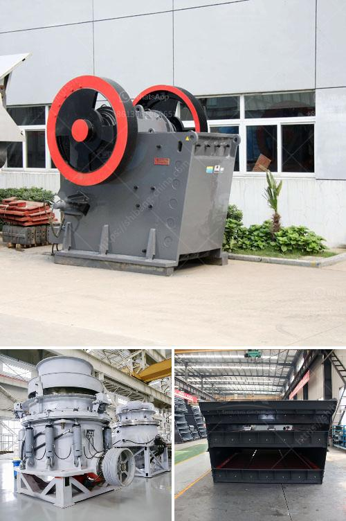

<h3>cocount crushing manchine</h3>
Coconut, widely known as the "tree of life," is one of the most abundant and useful plants found in tropical regions. Almost every part of the coconut tree, including the fruit, husk, shell, and leaves, is utilized for various purposes. Among these, the coconut fruit, with its nutritious water and meat, holds significant importance.

The extraction of coconut water and oil is a crucial part of the coconut processing industry. To efficiently extract these valuable products, a coconut crushing machine is utilised. This machine plays a vital role in breaking the tough outer shell of the coconut and crushing the inner meat into smaller and finer particles. Let's explore further how a coconut crushing machine revolutionizes the coconut processing industry.

Firstly, a coconut crushing machine significantly saves time and effort. Before the invention of such machines, extracting coconut meat was a labor-intensive task that required immense manual effort. Workers would use traditional methods like hammers, machetes, or bare hands to open the coconut shells. This process was arduous, time-consuming, and often resulted in injuries. However, with the introduction of coconut crushing machines, the entire process has been simplified and expedited, thus improving productivity in the industry.

Secondly, the coconut crushing machine ensures higher efficiency in the extraction process. The machine is specifically designed to crush coconuts uniformly, ensuring that each part of the meat is adequately crushed. This helps extract a higher quantity of coconut oil and water, leading to better yields. By increasing the efficiency of the extraction process, manufacturers can produce more coconut-based products and meet the growing demands of both the domestic and international markets.

Moreover, the coconut crushing machine enhances hygiene and food safety. The traditional hand-cracking method often resulted in the accumulation of microorganisms on the coconut's outer shell. These microorganisms could contaminate the meat, water, or oil, reducing the overall quality and even posing health risks. However, with a crushing machine, the hard shell is shattered immediately, reducing the chances of bacterial or fungal growth. This ensures that the extracted coconut products are safe and hygienic, meeting the stringent quality standards set by regulatory authorities.

Furthermore, the machine enables versatility and diversification in coconut processing. Different industries, such as the food, beverage, cosmetics, and pharmaceutical sectors, require different sizes and consistencies of coconut meat or extracts. A coconut crushing machine can be easily adjusted to achieve the desired level of crushing, allowing manufacturers to cater to various market needs. This versatility opens doors for more innovations in coconut-based products, resulting in increased consumer choices.

In conclusion, a coconut crushing machine has revolutionized the coconut processing industry by providing an efficient, time-saving, and hygienic solution for extracting coconut meat. Its ability to enhance productivity, improve yields, and diversify product offerings has made it an invaluable tool for manufacturers worldwide. As the demand for coconut-based products continues to rise, coconut crushing machines will play an increasingly vital role in meeting these demands while ensuring high-quality and safe end products.
<h3>Contact us</h3><ul><li><strong>Whatsapp:&nbsp;<a href="https://wa.me/8613661969651">+8613661969651</a></strong></li><li><a href="https://swt.shibang-china.com/?git&amp;zhl&amp;cocount crushing manchine"><strong>Online Service(chat now)</strong></a></li></ul><h3>Related</h3><ul><li><a href='price quotation for rotary kiln machine.md'>price quotation for rotary kiln machine</a></li><li><a href='kenya cement plant.md'>kenya cement plant</a></li><li><a href='industrial roller mill.md'>industrial roller mill</a></li><li><a href='equipment used in open pit copper ore mining plant.md'>equipment used in open pit copper ore mining plant</a></li><li><a href='jaw crusher for sale in china.md'>jaw crusher for sale in china</a></li></ul>