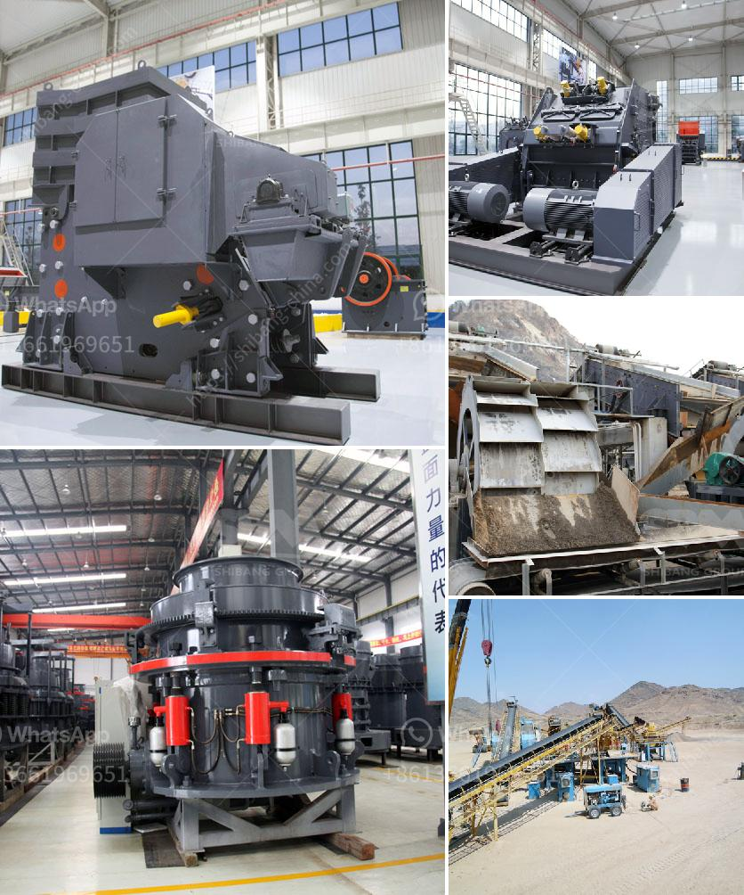

<h3>companies companies in charge of vibrating screens</h3>
In today's fast-paced world, technology plays a significant role in various industries. One crucial piece of equipment that contributes to efficiency and productivity is the vibrating screen. This device is used to separate and classify different materials, making it an essential tool in various sectors, including mining, construction, recycling, and aggregate production. However, behind these vibrating screens are companies responsible for their manufacturing and maintenance, offering cutting-edge solutions to meet industry demands.

One prominent player in the vibrating screen industry is XYZ Company. Established in 1995, they have been at the forefront of innovation, offering a wide range of vibrating screens to cater to diverse applications. Their expertise lies in designing and manufacturing high-quality screens with advanced features to ensure optimum performance and durability.

One of XYZ Company's flagship products is their range of high-frequency vibrating screens. These screens are designed for applications that require precise particle separation and efficient processing. With the use of high-frequency vibrations, these screens can separate even the finest particles, enhancing the quality of the final product. Moreover, these screens are built to withstand harsh environments, ensuring longevity and reducing downtime.

Another leading company in the vibrating screen industry is ABC Manufacturing. With more than three decades of experience, they have gained a stellar reputation for their state-of-the-art vibrating screen solutions. ABC Manufacturing combines innovative technologies with comprehensive expertise to develop customized screens that meet the specific requirements of their clients.

ABC Manufacturing offers a diverse range of vibrating screens, including horizontal screens, inclined screens, and multi-slope screens. Their screens are known for their efficiency in separating various materials, such as aggregate, coal, and minerals. Additionally, the company provides comprehensive after-sales services, including maintenance, repairs, and spare parts, ensuring uninterrupted operation and customer satisfaction.

A rising star in the vibrating screen market is DEF Corporation. Established in 2010, they have quickly gained recognition for their commitment to excellence and customer-centric approach. DEF Corporation specializes in manufacturing large vibrating screens used in industrial applications, such as mining and quarrying. Their screens are known for their robust construction, ensuring durability and reliable performance in demanding environments.

DEF Corporation's flagship product, the XYZ screen, offers high capacity screening with minimal downtime. This screen is designed with innovative features, including advanced motion analysis and optimized balancing, resulting in superior sieving efficiency. Furthermore, DEF Corporation provides comprehensive training programs to ensure efficient operation and maintenance of their screens, enhancing client satisfaction.

In conclusion, vibrating screens are vital equipment in various industries, facilitating efficient particle separation and material classification. Companies such as XYZ Company, ABC Manufacturing, and DEF Corporation are leading the way in manufacturing and maintaining high-performance vibrating screens. With their cutting-edge technologies and client-centric approaches, these companies continue to provide innovative solutions to meet the diverse demands of industries worldwide.
<h3>Contact us</h3><ul><li><strong>Whatsapp:&nbsp;<a href="https://wa.me/8613661969651">+8613661969651</a></strong></li><li><a href="https://swt.shibang-china.com/?git&amp;zhl&amp;companies companies in charge of vibrating screens"><strong>Online Service(chat now)</strong></a></li></ul><h3>Related</h3><ul><li><a href='trapizium mill for purvelising.md'>trapizium mill for purvelising</a></li><li><a href='charcoal pulverizer machine philippines.md'>charcoal pulverizer machine philippines</a></li><li><a href='roller mill from china.md'>roller mill from china</a></li><li><a href='tracked jaw crusher for sale.md'>tracked jaw crusher for sale</a></li><li><a href='stone crushers for sale kenya.md'>stone crushers for sale kenya</a></li></ul>