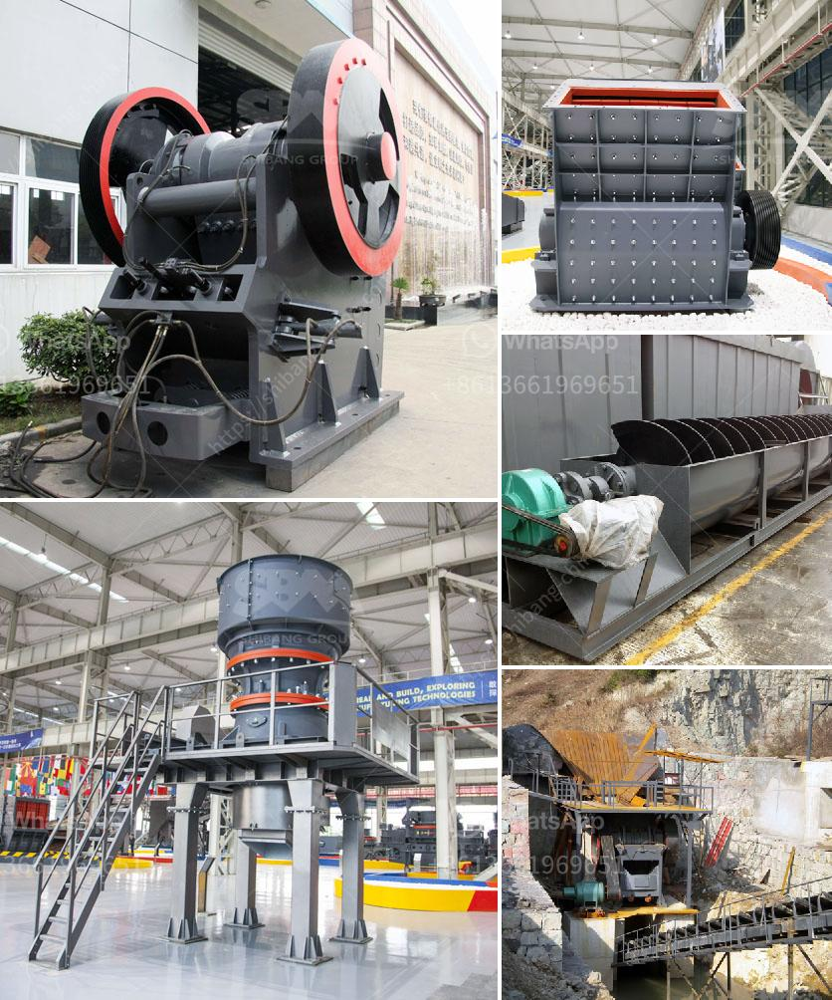

<h3>companies crushing plant</h3>
In today's society, the demand for raw materials and resources is higher than ever. As a result, companies are constantly looking for ways to efficiently extract these materials to meet the needs of a growing population. One such method is through the use of crushing plants.

A crushing plant is a facility that processes materials by grinding or crushing them into smaller pieces. It is commonly used in industries such as mining, construction, and recycling. These plants can crush a wide range of materials, including rocks, concrete, and asphalt.

Why do companies opt for crushing plants? The answer lies in the multiple benefits they offer. Firstly, crushing plants allow companies to take advantage of resources that would otherwise go to waste. For instance, when a construction site is demolished, the concrete and bricks can be crushed and recycled to be used in future construction projects.

Secondly, crushing plants increase the efficiency of resource extraction. By crushing materials into smaller pieces, they become easier to handle and transport. This means that companies can extract more resources in a shorter timeframe, reducing costs and maximizing profits.

Moreover, crushing plants help to reduce the impact on the environment. By recycling materials, less waste ends up in landfills, and the need for new extraction is minimized. Additionally, the dust and noise generated during the crushing process can be significantly reduced and controlled, ensuring a more sustainable operation.

In conclusion, crushing plants are an essential tool for companies in various industries. They enable the efficient extraction of resources, reduce waste, and minimize environmental impact. As the demand for raw materials continues to rise, it is increasingly important for companies to invest in sustainable solutions like crushing plants to meet these demands and minimize their carbon footprint.
<h3>Contact us</h3><ul><li><strong>Whatsapp:&nbsp;<a href="https://wa.me/8613661969651">+8613661969651</a></strong></li><li><a href="https://swt.shibang-china.com/?git&amp;zhl&amp;companies crushing plant"><strong>Online Service(chat now)</strong></a></li></ul><h3>Related</h3><ul><li><a href='jaw crusher buatan philippines 250 ton hari.md'>jaw crusher buatan philippines 250 ton hari</a></li><li><a href='ball mill lining made in china.md'>ball mill lining made in china</a></li><li><a href='concrete crusher price.md'>concrete crusher price</a></li><li><a href='accessories for chia conveyor belts.md'>accessories for chia conveyor belts</a></li><li><a href='turkey plant production line of gypsum powder.md'>turkey plant production line of gypsum powder</a></li></ul>