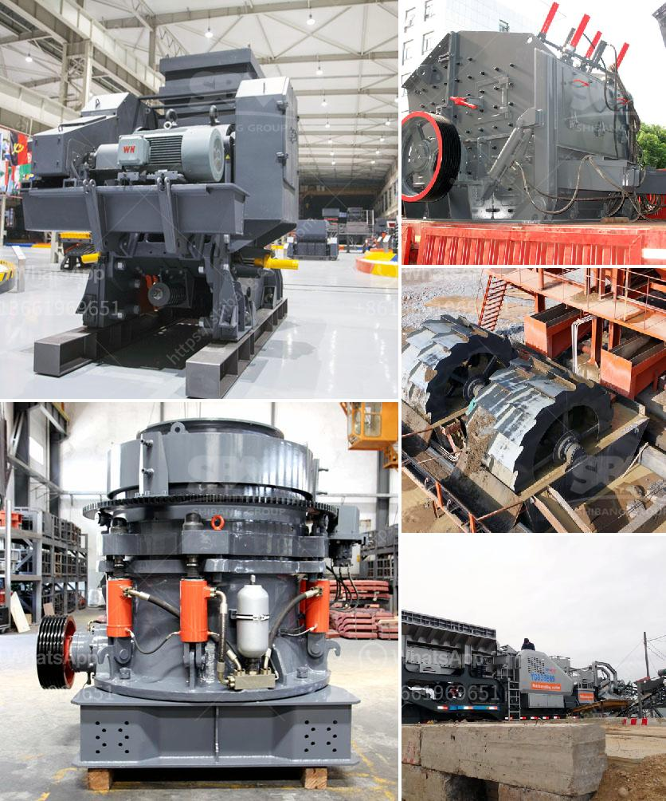

<h3>companies selling mining equipment</h3>
The resource industry, especially mining, plays a crucial role in the global economy. To extract valuable minerals and resources from the earth, modern miners depend heavily on advanced mining equipment. Thankfully, there is no shortage of companies selling top-notch mining equipment, catering to the needs of the resource industry.

These companies understand the importance of high-quality and durable mining equipment and invest heavily in research and development to provide the best solutions. Their product portfolios include a wide range of machinery, including excavators, bulldozers, loaders, crushers, and drilling equipment, all designed to make mining operations more efficient, safer, and more sustainable.

One of the primary advantages of purchasing equipment from these specialized companies is their expertise. They understand the challenges faced by miners and offer tailor-made solutions to overcome them. Whether it's working in extreme weather conditions, challenging terrains, or stringent emission regulations, these companies have the know-how to deliver equipment that meets these unique requirements.

Additionally, these companies also offer comprehensive after-sales services, including maintenance, repairs, and spare parts supply, ensuring minimal downtime and maximum productivity for their customers.

Moreover, with the increasing emphasis on sustainability, many mining equipment manufacturers are incorporating innovative features to reduce the environmental impact of mining operations. From fuel-efficient engines to advanced technology for waste recycling, these companies are contributing to making mining more eco-friendly.

In conclusion, the presence of companies selling mining equipment is a game-changer for the resource industry. Their products and expertise are vital for achieving optimum productivity, safety, and sustainability in mining operations. As technology continues to evolve, we can expect these companies to innovate further and drive the industry towards a more efficient and responsible future.
<h3>Contact us</h3><ul><li><strong>Whatsapp:&nbsp;<a href="https://wa.me/8613661969651">+8613661969651</a></strong></li><li><a href="https://swt.shibang-china.com/?git&amp;zhl&amp;companies selling mining equipment"><strong>Online Service(chat now)</strong></a></li></ul><h3>Related</h3><ul><li><a href='ball mill company in tamilnadu.md'>ball mill company in tamilnadu</a></li><li><a href='quartz crusher machinery.md'>quartz crusher machinery</a></li><li><a href='portable coal crusher.md'>portable coal crusher</a></li><li><a href='ball mill for limestone grinding power calculation.md'>ball mill for limestone grinding power calculation</a></li><li><a href='brand of ball mills.md'>brand of ball mills</a></li></ul>