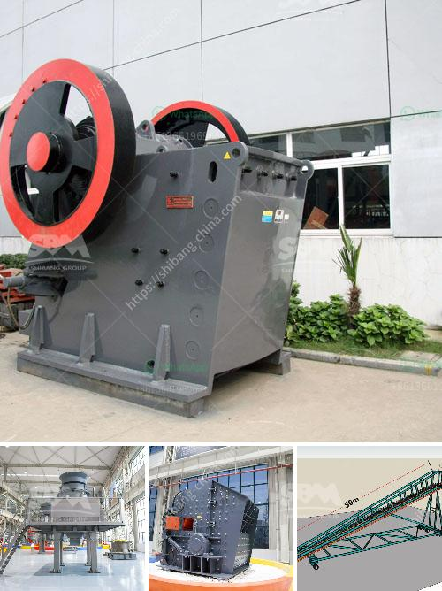

<h3>company in japan dealing in portable crusher machine</h3>
Waste management has become a pressing issue globally, and nations across the world are focusing on sustainable solutions to tackle this challenge. Japan, known for its technological advancements, is at the forefront of developing innovative waste management systems. One such company leading the way is a Japanese firm specializing in portable crusher machines. With their cutting-edge technology and commitment to environmental sustainability, this company is revolutionizing waste management practices in Japan.

Portable crusher machines are compact and versatile equipment that efficiently crushes construction waste, demolishing debris, and other forms of waste materials. Recognizing the increasing demand for such equipment as urbanization accelerates, the Japanese company took it upon themselves to develop smart and effective solutions.

The company's strong focus on research and development has enabled them to design and manufacture advanced portable crusher machines that meet the diverse needs of waste management. Leveraging innovative technologies, they have created machines that consume less energy, offer high-capacity crushing capabilities, and ensure minimal environmental impact.

These portable crusher machines have versatile applications and can handle various types of waste materials effectively. Whether it's concrete, bricks, stones, asphalt, or even glass, these machines can crush them all. With multiple crushing options and adjustable settings, they can produce a wide range of aggregate sizes, making them ideal for use in construction projects, road works, and recycling operations.

The portability factor of these crusher machines plays a vital role in their success. Designed to be compact and easily transportable, they can be moved effortlessly to any site, reducing the need for multiple units. This saves both time and money while increasing operational efficiency. Additionally, their small footprint makes them suitable for urban areas with limited space for construction equipment.

Environmental sustainability is at the core of this Japanese company's operations. Their portable crusher machines utilize advanced dust suppression systems, minimizing the release of harmful particles into the atmosphere. Moreover, the machines feature lower noise levels, ensuring minimal disturbance to the surrounding areas. The company is dedicated to continually improving their products' energy efficiency, reducing greenhouse gas emissions, and promoting a greener future.

The company takes pride in providing exceptional customer service and support. They offer comprehensive training programs to ensure efficient machine operations and provide regular maintenance and spare parts solutions. This commitment to customer satisfaction has earned them a strong reputation and a loyal clientele base not only in Japan but also in international markets.

The Japanese company specializing in portable crusher machines has emerged as a market leader in waste management technology. Through continuous innovation, they have developed machinery that not only meets industry demands but also respects the environment. Their offerings have proven to be versatile, energy-efficient, and effective, making them highly sought-after in construction and waste management sectors worldwide. As Japan continues to be a beacon of technological advancement, companies like these contribute significantly to solving global waste management challenges and paving the way for a sustainable future.
<h3>Contact us</h3><ul><li><strong>Whatsapp:&nbsp;<a href="https://wa.me/8613661969651">+8613661969651</a></strong></li><li><a href="https://swt.shibang-china.com/?git&amp;zhl&amp;company in japan dealing in portable crusher machine"><strong>Online Service(chat now)</strong></a></li></ul><h3>Related</h3><ul><li><a href='zinc ore processing plant.md'>zinc ore processing plant</a></li><li><a href='crusher sale philippines.md'>crusher sale philippines</a></li><li><a href='old used farm hammer mills.md'>old used farm hammer mills</a></li><li><a href='sale of roll mill machine.md'>sale of roll mill machine</a></li><li><a href='ball mills for grinding lime.md'>ball mills for grinding lime</a></li></ul>