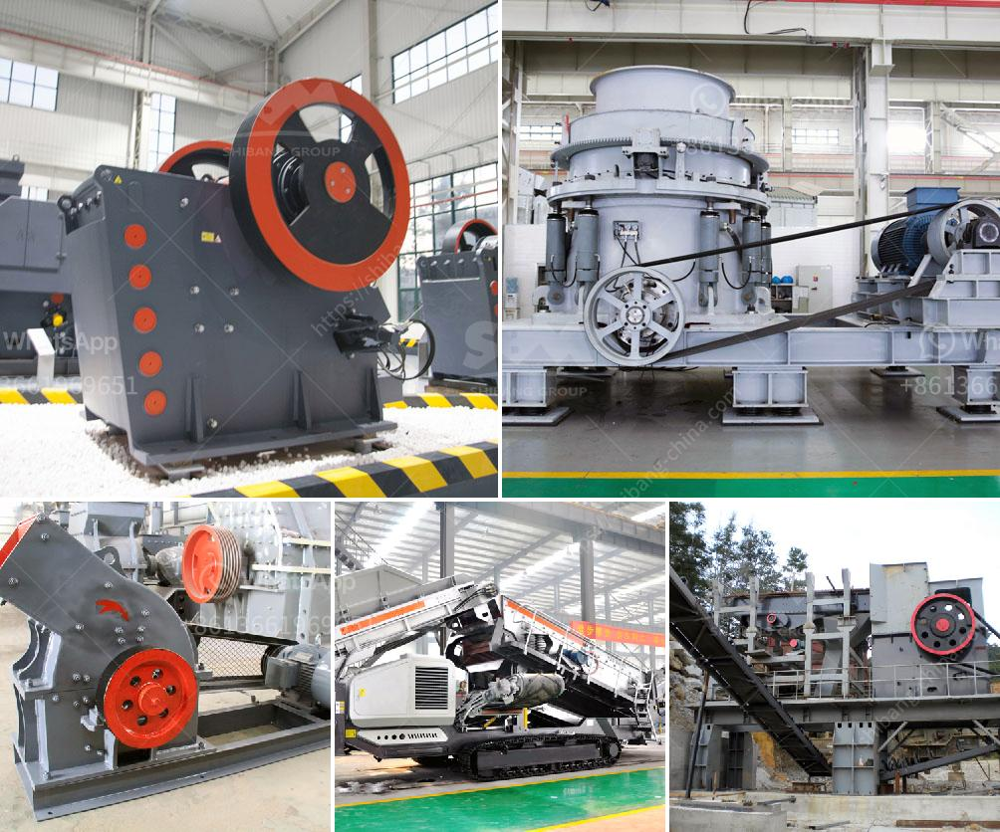

<h3>complete gravel production line</h3>
A complete gravel production line is indispensable in construction projects and road building. Gravel is a fundamental material used in various applications, including concrete production, road construction, and landscaping. To meet the growing demand for gravel, a complete gravel production line is necessary to efficiently process and supply gravel to various industries.

A gravel production line typically consists of several stages, each designed to process the raw materials into specific sizes and shapes required for the intended application. The first stage is the extraction of gravel from natural deposits, such as rivers, streams, or quarries. The extracted gravel is then transported to a primary crusher, where it is reduced in size to a more manageable form.

Next, the material goes through a series of processing equipment, including vibrating screens, conveyors, and secondary crushers, to further refine the size and quality of gravel. These equipment are designed to remove any impurities from the gravel, such as clay, silt, or dust, ensuring a clean and uniform product.

After the gravel is processed, it can be sorted into different sizes using specialized screens and separators. This allows for easy classification and segregation of gravel into various grades, catering to the specific requirements of different applications.

Finally, the processed gravel is transported and stored in stockpiles or silos ready for shipment or use. A complete gravel production line is designed to operate efficiently and continuously, ensuring a steady supply of gravel regardless of the demand.

In conclusion, a complete gravel production line is an essential component in the construction industry. It enables the efficient processing and supply of gravel, which is crucial for various applications. By investing in a complete gravel production line, construction companies and road builders can ensure a reliable and high-quality source of gravel for their projects, ultimately leading to successful and sustainable infrastructure development.
<h3>Contact us</h3><ul><li><strong>Whatsapp:&nbsp;<a href="https://wa.me/8613661969651">+8613661969651</a></strong></li><li><a href="https://swt.shibang-china.com/?git&amp;zhl&amp;complete gravel production line"><strong>Online Service(chat now)</strong></a></li></ul><h3>Related</h3><ul><li><a href='equipment used in open pit copper ore mining plant.md'>equipment used in open pit copper ore mining plant</a></li><li><a href='breaker crusher used for coal crushing.md'>breaker crusher used for coal crushing</a></li><li><a href='flsmidth cement plant in egypt.md'>flsmidth cement plant in egypt</a></li><li><a href='diamond mining equipment.md'>diamond mining equipment</a></li><li><a href='zeolite sand making machine manufacturer.md'>zeolite sand making machine manufacturer</a></li></ul>