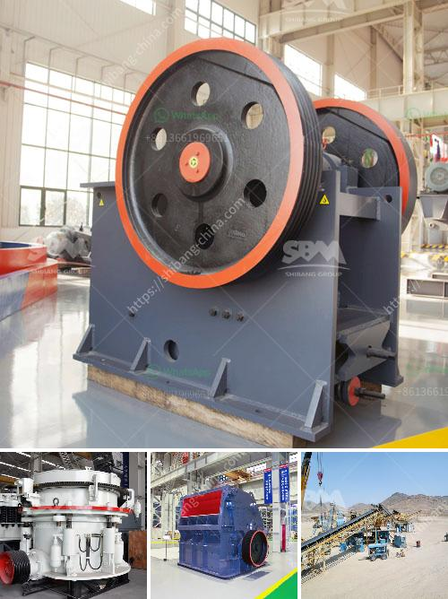

<h3>complete iron ore processing plant cost</h3>
Iron ore is a key raw material for steel production, and its demand has been consistently high in recent years. With the continuous increase in iron ore prices, the construction of iron ore processing plants has become an important trend in the industry.

Iron ore processing plants consist of multiple processing stages, ranging from sorting and sizing to further refining and pelletization. These plants are essential in transforming the raw ore into high-quality iron ore products suitable for various industries.

The cost of setting up a complete iron ore processing plant greatly depends on the type and scale of the project. For instance, a small-scale iron ore processing plant may cost a few million dollars, whereas an integrated mining and processing facility with multiple processing stages and a large production capacity could cost several billion dollars.

The main factors impacting the cost of an iron ore processing plant include the quality of the ore, the cost of extraction and transportation of the ore, the energy consumption of the processing plant, and the equipment and machinery used.

Advanced technologies and efficient processing techniques have enabled the optimization of iron ore processing plants, leading to reduced production costs. For example, using magnetic separation and gravity separation methods can effectively recover and concentrate iron ore while minimizing the use of energy and reducing environmental impacts.

Furthermore, modern iron ore processing plants often implement process automation and control systems to optimize the entire production process and improve operational efficiency. This results in reduced labor costs and increased productivity.

Overall, the cost of setting up a complete iron ore processing plant varies depending on various factors such as the scale of the operation, the quality of the ore, and the use of advanced technologies. However, investing in iron ore processing plants can be a profitable venture, considering the consistently high demand for iron ore and the potential for competitive advantage in the steel industry.
<h3>Contact us</h3><ul><li><strong>Whatsapp:&nbsp;<a href="https://wa.me/8613661969651">+8613661969651</a></strong></li><li><a href="https://swt.shibang-china.com/?git&amp;zhl&amp;complete iron ore processing plant cost"><strong>Online Service(chat now)</strong></a></li></ul><h3>Related</h3><ul><li><a href='talc powder production.md'>talc powder production</a></li><li><a href='advantage and disadvantage of jaw crusher.md'>advantage and disadvantage of jaw crusher</a></li><li><a href='kaolin clay processing flow chart.md'>kaolin clay processing flow chart</a></li><li><a href='feldspar vsi crusher.md'>feldspar vsi crusher</a></li><li><a href='granite quarry crusher in nigeria.md'>granite quarry crusher in nigeria</a></li></ul>