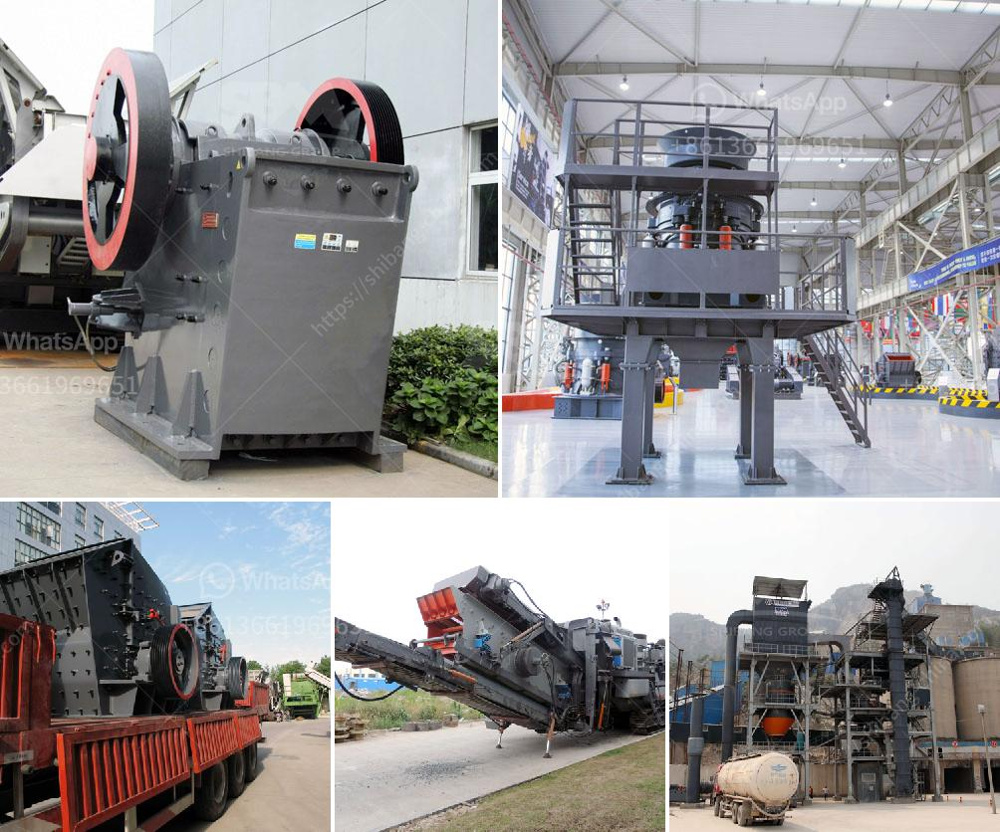

<h3>complete mobile stone crushing machine 30th</h3>
In the realm of construction, the use of heavy equipment and machinery has become an integral part of the construction process. One such machine that has revolutionized the construction industry is the complete mobile stone crushing machine 30th. With its ability to crush a variety of materials, including concrete, asphalt, and demolition waste, this machine has become a game-changer in the construction industry.

The complete mobile stone crushing machine 30th is a compact crushing equipment that allows construction companies to crush and recycle materials on-site. This machine utilizes a fuel-efficient diesel engine, which means it is both cost-effective and environmentally friendly. Additionally, the machine is equipped with a high-capacity jaw crusher, which enables it to crush large pieces of material quickly and efficiently.

One of the major advantages of the complete mobile stone crushing machine 30th is its mobility. Unlike traditional crushers that are fixed to a specific location, this machine can be easily transported to different construction sites. This mobility allows construction companies to save time and money by eliminating the need for multiple crushers at various sites.

Furthermore, the complete mobile stone crushing machine 30th is equipped with advanced technology that enhances its performance. It is equipped with a hydraulic system that enables easy and quick adjustment of the crusher settings, ensuring optimal crushing results. Additionally, the machine is equipped with a reliable and user-friendly control panel, making it easy for operators to monitor and control the machine's operations.

The versatility of the complete mobile stone crushing machine 30th is another key feature. It can crush a wide range of materials, including concrete, asphalt, and demolition waste. This makes it an ideal choice for construction companies involved in various projects, ranging from road construction to building demolition. With the ability to crush materials on-site, construction companies can save transportation costs and reduce the risk of material contamination.

In addition to its crushing capabilities, the complete mobile stone crushing machine 30th also offers a unique solution for recycling construction materials. The machine is equipped with a built-in screening system, which allows construction companies to separate and reuse crushed materials. This not only reduces the amount of waste sent to landfills but also saves natural resources by reusing materials, ultimately contributing to a more sustainable construction industry.

The complete mobile stone crushing machine 30th has transformed the construction industry by offering a cost-effective, mobile, and versatile solution for crushing and recycling materials. Its ability to crush a variety of materials on-site, coupled with its mobility and advanced technology, has made it a game-changer in construction industries. With the increasing demand for sustainable construction practices, this machine provides construction companies with the means to embrace sustainable practices by reducing waste and reusing materials. It is evident that the complete mobile stone crushing machine 30th has indeed revolutionized the construction industry and will continue to do so in the future.
<h3>Contact us</h3><ul><li><strong>Whatsapp:&nbsp;<a href="https://wa.me/8613661969651">+8613661969651</a></strong></li><li><a href="https://swt.shibang-china.com/?git&amp;zhl&amp;complete mobile stone crushing machine 30th"><strong>Online Service(chat now)</strong></a></li></ul><h3>Related</h3><ul><li><a href='gold mining equipments africa.md'>gold mining equipments africa</a></li><li><a href='wet process and dry process of cement.md'>wet process and dry process of cement</a></li><li><a href='50 tpd cement plant manufacturer in china.md'>50 tpd cement plant manufacturer in china</a></li><li><a href='small scale marble crushing and processing industery.md'>small scale marble crushing and processing industery</a></li><li><a href='calcite processing equipment.md'>calcite processing equipment</a></li></ul>