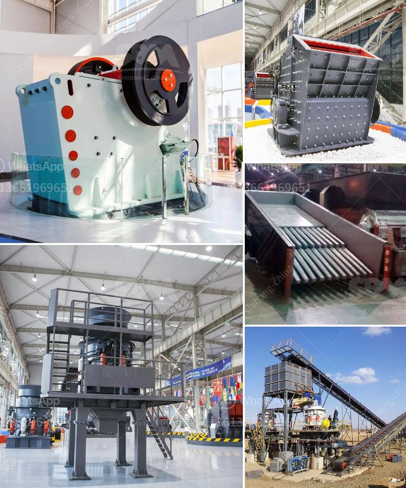

<h3>complete plant copper extraction processing for sale</h3>
Copper is an essential metal that plays a vital role in various industries, including electronics, construction, and transportation. As demand for copper continues to rise, the need for efficient copper extraction processing plants has become more crucial than ever. In this article, we will explore the process of complete plant copper extraction processing for sale.

The copper extraction process involves several stages, including mining, crushing, grinding, and flotation. Mining is the first step in the process, where copper ore in the ground is excavated and transported to the crushing plant. The ore is crushed into smaller pieces, which are then sent to the grinding mill.

In the grinding mill, the copper ore is further reduced in size to prepare it for the flotation process. Flotation is a widely used method for copper extraction, as it relies on the physical and chemical properties of copper minerals to separate them from the gangue materials. After grinding, the copper ore is mixed with water and various chemicals, such as collectors and frothers, and introduced into flotation cells. Air is blown into the cells, creating bubbles that carry the copper minerals to the surface, where they are collected and further processed.

A complete plant for copper extraction processing typically includes all the necessary equipment and machinery required for the various stages of the process. This includes crushers, grinding mills, flotation cells, and other specialized equipment. These plants are designed to have high production capacities and to be energy-efficient, ensuring optimal copper recovery while minimizing operational costs.

When looking for a complete plant for copper extraction processing for sale, there are several factors to consider. Firstly, it is important to choose a reputable supplier that has a track record of delivering high-quality equipment and providing excellent after-sales support. The supplier should have extensive experience in designing and manufacturing copper extraction plants, ensuring that the plant meets your specific requirements and production targets.

Additionally, it is worth considering the plant's scalability and flexibility. As copper production requirements may change over time, it is crucial to select a plant that can be easily expanded or modified to accommodate future needs. This flexibility also allows for the integration of new technologies and processes to optimize copper recovery and improve overall efficiency.

Furthermore, environmental considerations should not be overlooked. Copper extraction processes can have a significant impact on the environment if not properly managed. Therefore, it is essential to choose a plant that incorporates sustainable practices and technologies, such as water recycling systems and dust control measures, to minimize the environmental footprint.

In conclusion, complete plant copper extraction processing for sale is a crucial investment for companies seeking to capitalize on the growing demand for copper. By selecting a reputable supplier and considering factors such as scalability, flexibility, and environmental sustainability, companies can ensure that the chosen plant meets their production needs effectively and efficiently. With the right plant and equipment in place, companies can extract copper from ore and contribute to the development of various industries that rely on this essential metal.
<h3>Contact us</h3><ul><li><strong>Whatsapp:&nbsp;<a href="https://wa.me/8613661969651">+8613661969651</a></strong></li><li><a href="https://swt.shibang-china.com/?git&amp;zhl&amp;complete plant copper extraction processing for sale"><strong>Online Service(chat now)</strong></a></li></ul><h3>Related</h3><ul><li><a href='quotation ball mill.md'>quotation ball mill</a></li><li><a href='price of grinder machine in malaysia.md'>price of grinder machine in malaysia</a></li><li><a href='recycled glass countertops south africa.md'>recycled glass countertops south africa</a></li><li><a href='mini rock mobile jaw crusher west africa price in uk.md'>mini rock mobile jaw crusher west africa price in uk</a></li><li><a href='stone crushers in veracruz.md'>stone crushers in veracruz</a></li></ul>