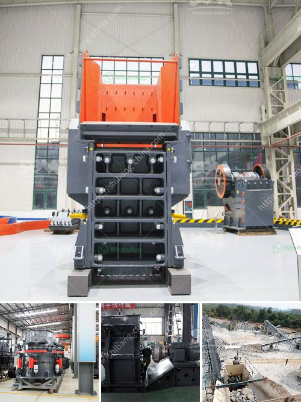

<h3>component and processes of cement</h3>
Cement is a widely used construction material that forms the foundation of structures like buildings, bridges, and roads. It is a versatile and durable material that provides strength and stability to these structures. Understanding the components and processes involved in the production of cement is crucial to comprehend its properties and quality. Let's delve into the details of these aspects.

1. Cement Clinker: Cement is primarily composed of cement clinker, a key ingredient in its production. Cement clinker is a nodular material produced by heating a mixture of limestone, clay, and other additives at high temperatures. The resulting clinker is ground into fine powder to make cement. The composition of the clinker may vary, depending on the raw materials used and the desired properties of the cement.

2. Gypsum: Gypsum is another essential component of cement, added during the grinding process. It acts as a setting regulator, controlling the setting time of cement. It prevents the quick setting of cement, allowing sufficient time for it to be mixed, placed, and finished.

1. Mining and Quarrying: The first step in cement production involves the extraction of raw materials from mines or quarries. Limestone, clay, and shale are the primary materials used in the production of cement. These materials are typically found in large deposits and are extracted using drilling, blasting, or excavation methods.

2. Crushing and Grinding: The raw materials extracted from the mines or quarries are crushed into smaller pieces to enhance their processability. This process involves using crushers and mills to reduce the size of the raw materials. The crushed materials are then further ground into a fine powder known as raw meal.

3. Preheating: The raw meal is preheated in a preheater tower before entering the kiln. In this process, the raw meal is heated using waste heat recovered from the kiln, improving energy efficiency. Preheating also promotes chemical reactions that occur during the next stages.

4. Kiln Process: The preheated raw meal is fed into a rotary kiln where it is subjected to extremely high temperatures of around 1450 degrees Celsius. This intense heat causes the raw meal to undergo chemical reactions, resulting in the formation of clinker. The clinker exits the kiln and is cooled using air or water.

5. Grinding: The cooled clinker is then ground into a fine powder using ball mills or vertical roller mills. This grinding process enhances the cement's fineness, allowing it to achieve desired strength and setting properties.

6. Additives: Cement may contain additives that enhance its properties or satisfy specific requirements. Fly ash, slag, silica fume, or limestone can be added during the grinding process to improve cement's durability, workability, or environmental performance.

7. Packaging and Distribution: The final cement product is typically packaged in bags or stored in silos for distribution to construction sites or retailers. Quality control measures are implemented to ensure that the cement meets specific standards and requirements.

Understanding the components and processes involved in cement production helps in assessing its quality, performance, and suitability for various applications. It also highlights the importance of sustainable practices, such as using alternative raw materials and reducing carbon emissions. As the construction industry continues to evolve, advancements in cement production processes are crucial to meet the growing demands for reliable and eco-friendly construction materials.
<h3>Contact us</h3><ul><li><strong>Whatsapp:&nbsp;<a href="https://wa.me/8613661969651">+8613661969651</a></strong></li><li><a href="https://swt.shibang-china.com/?git&amp;zhl&amp;component and processes of cement"><strong>Online Service(chat now)</strong></a></li></ul><h3>Related</h3><ul><li><a href='manganese ore wash plant.md'>manganese ore wash plant</a></li><li><a href='small jaw crusher for sale.md'>small jaw crusher for sale</a></li><li><a href='ball mill in hindi.md'>ball mill in hindi</a></li><li><a href='raymond grinding mill manufacturers india.md'>raymond grinding mill manufacturers india</a></li><li><a href='quartz stone machine price.md'>quartz stone machine price</a></li></ul>