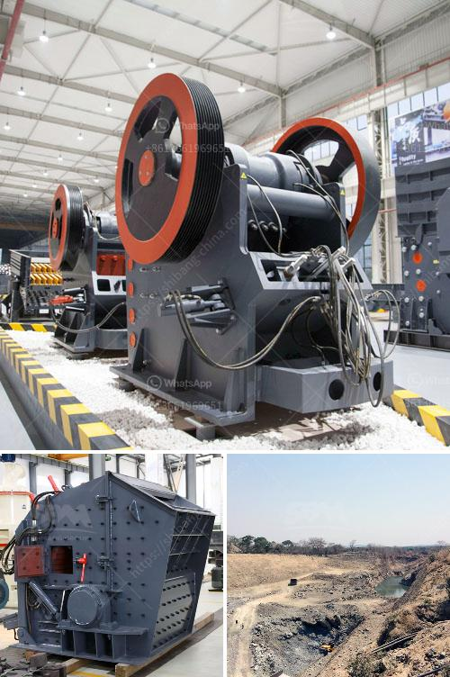

<h3>components cone crusher and hydraulic system</h3>
A cone crusher is a type of equipment used to break rocks in the mining industry. It is typically used for secondary crushing of rocks and ores. The hydraulic system on a cone crusher is a critical component that helps to provide the necessary power to crush the rocks.

In the modern cone crushers, the hydraulic system is responsible for providing a safe and effective way to adjust the settings of the crusher, ensuring optimal performance. It also helps to prevent any unnecessary downtime due to debris or other objects getting stuck in the machine.

The main components of a cone crusher include the feed hopper, main shaft, mantle, concaves, eccentric shaft, hydraulic system, and discharge opening. The hydraulic system allows for the adjustment of the discharge opening and the setting of the crusher's parameters in real time.

One of the key components of the hydraulic system is the hydraulic cylinder. This cylinder is responsible for adjusting the crusher's discharge opening size and ensuring the proper operation of the crusher. It works by applying pressure to the hydraulic fluid, which then in turn applies pressure to the crusher's main shaft. This allows for the adjustment of the crusher's settings and the control of the size of the crushed material.

Another important component of the cone crusher's hydraulic system is the accumulator. This component helps to store the hydraulic fluid in case of an emergency or power failure. It acts as a backup system, providing additional hydraulic fluid to the cylinder in case it is needed. This ensures that the crusher can still function properly even in adverse conditions.

The hydraulic system also includes hydraulic pumps and motors. These components are responsible for generating the necessary power for the hydraulic fluid to flow through the system and operate the crusher. The pumps create the pressure required for the hydraulic fluid to function, while the motors help to provide the necessary torque to move the crusher's components.

Overall, the hydraulic system is a critical component of a cone crusher. It helps to provide the necessary power and control for the crusher's operation, allowing for optimal performance and preventing any unnecessary downtime. Proper maintenance and regular checks on the hydraulic system can help to ensure its longevity and reliability, ultimately extending the lifespan of the cone crusher.

In conclusion, the components of a cone crusher and its hydraulic system work together to provide a safe and efficient way to break rocks in the mining industry. Each component plays a crucial role in the overall functioning of the crusher, ensuring that it can operate at its full capacity and deliver the desired results. It is important for operators to understand the different components and their functions to properly maintain and troubleshoot any issues that may arise with the cone crusher.
<h3>Contact us</h3><ul><li><strong>Whatsapp:&nbsp;<a href="https://wa.me/8613661969651">+8613661969651</a></strong></li><li><a href="https://swt.shibang-china.com/?git&amp;zhl&amp;components cone crusher and hydraulic system"><strong>Online Service(chat now)</strong></a></li></ul><h3>Related</h3><ul><li><a href='brick stone crusher machine.md'>brick stone crusher machine</a></li><li><a href='stone crusher machine in india.md'>stone crusher machine in india</a></li><li><a href='chromite processing plant equipment for pakistan.md'>chromite processing plant equipment for pakistan</a></li><li><a href='ball mill calcium carbonat.md'>ball mill calcium carbonat</a></li><li><a href='50 tpd mini cement plant task cost in india.md'>50 tpd mini cement plant task cost in india</a></li></ul>