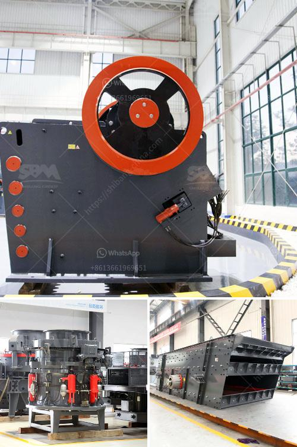

<h3>concrete crusher for sale ethiopia</h3>
Ethiopia is currently going through a construction boom and the demand for concrete is increasing exponentially. However, the shortage of raw materials for concrete production is becoming an issue that needs to be addressed. This is where a concrete crusher comes into play. It is a machine that is designed to crush concrete into gravel, which is used as a base material for construction projects.

A concrete crusher for sale in Ethiopia can provide a great opportunity to upgrade the construction industry in the country. This machine can take concrete crushing to a whole new level and significantly improve the efficiency and quality of construction projects.

One of the key benefits of a concrete crusher is its ability to repurpose concrete waste into valuable materials. Instead of disposing of unused or waste concrete, it can be crushed and used as a base material for new construction projects. This not only helps in saving costs for sourcing new materials but also reduces the environmental impact by reusing existing concrete.

Furthermore, a concrete crusher can increase the speed of construction projects. By crushing the concrete on-site, construction teams don't have to wait for the delivery of new materials, leading to time savings and increased productivity. Additionally, the crushed concrete can be used immediately, eliminating the need for additional curing time.

A concrete crusher for sale in Ethiopia also opens up new opportunities for the recycling industry. With the growing concern for environmental sustainability, concrete recycling is becoming a popular practice worldwide. By investing in a concrete crusher, businesses can start their own recycling operations and generate additional revenue, while contributing to a greener and more sustainable future.

In conclusion, a concrete crusher for sale in Ethiopia is a valuable investment opportunity that can bring significant improvements to the construction industry. It allows for the repurposing of waste materials, increases construction speed, and opens up new opportunities for recycling. As the demand for concrete continues to rise, investing in a concrete crusher can be a game-changer for construction companies in Ethiopia.
<h3>Contact us</h3><ul><li><strong>Whatsapp:&nbsp;<a href="https://wa.me/8613661969651">+8613661969651</a></strong></li><li><a href="https://swt.shibang-china.com/?git&amp;zhl&amp;concrete crusher for sale ethiopia"><strong>Online Service(chat now)</strong></a></li></ul><h3>Related</h3><ul><li><a href='sand making machine cost.md'>sand making machine cost</a></li><li><a href='cement making process.md'>cement making process</a></li><li><a href='small feldspar grinding milling plant in nigeria.md'>small feldspar grinding milling plant in nigeria</a></li><li><a href='list of cement plants in nalgonda district.md'>list of cement plants in nalgonda district</a></li><li><a href='limestone production process.md'>limestone production process</a></li></ul>