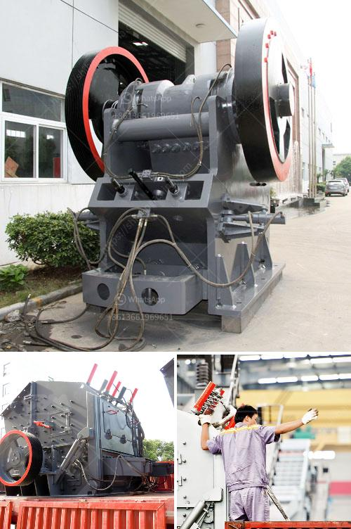

<h3>concrete crusher plant uae</h3>
Construction industry in the United Arab Emirates (UAE) is one of the fastest developing sectors that contribute to majority of the GDP. While 70% of the land of UAE is covered by desert, the remaining 30% is heavily inhabited with concrete structures providing shelter for millions. Thus, there is a huge demand for construction materials and equipment in the country. One such crucial equipment is the concrete crusher plant, which helps in performing various concrete recycling tasks for construction projects.

The UAE boasts of large quantities of construction waste generated by the ongoing infrastructure projects. Concrete recycling is becoming an increasingly popular way to utilize this waste material for sustainable purposes. The concrete crusher plant plays a vital role in enhancing the efficiency and productivity of the construction waste recycling process.

Concrete is one of the most important raw materials used in the construction industry. It consists of cement, water, and aggregates. However, during the construction process, concrete waste is generated from various activities like demolition, refurbishment, or excavation. Instead of disposing this waste, it can be crushed and repurposed as recycled aggregate, reducing the need for further extraction of natural resources.

The concrete crusher plant UAE is equipped with advanced technology and possesses a team of highly skilled professionals to operate and maintain the plant. Unlike other recycling plants, the UAE has their own crusher plant which ensures a timely supply of crushed materials. The facility has the capacity to recycle approximately 2 million tons of waste material per year, contributing significantly to the reduction in landfill and preserving natural resources.

Furthermore, the concrete crusher plant helps in reducing the emission of CO2 into the atmosphere by recycling the waste material locally. This eliminates the need for transportation of construction waste and the associated fuel consumption. Thus, using recycled concrete helps in reducing carbon footprint and promoting a greener environment.

In conclusion, the concrete crusher plant in UAE plays a vital role in sustainable waste management and promotes environmental protection. The UAE government has taken various initiatives to reduce the carbon footprint and encourage recycling in the construction industry. The concrete crusher plant not only saves resources but also boosts the economy by creating job opportunities and attracting foreign investments in the recycling sector. It is indeed a successful business solution for the UAE construction industry, providing a win-win situation for the environment and the economy.
<h3>Contact us</h3><ul><li><strong>Whatsapp:&nbsp;<a href="https://wa.me/8613661969651">+8613661969651</a></strong></li><li><a href="https://swt.shibang-china.com/?git&amp;zhl&amp;concrete crusher plant uae"><strong>Online Service(chat now)</strong></a></li></ul><h3>Related</h3><ul><li><a href='slag crusher machine india.md'>slag crusher machine india</a></li><li><a href='south africa biggest chrome wash plant.md'>south africa biggest chrome wash plant</a></li><li><a href='how to grind silica sand.md'>how to grind silica sand</a></li><li><a href='sand washing machine in saudi arabia.md'>sand washing machine in saudi arabia</a></li><li><a href='bison 120 crusher for sale.md'>bison 120 crusher for sale</a></li></ul>